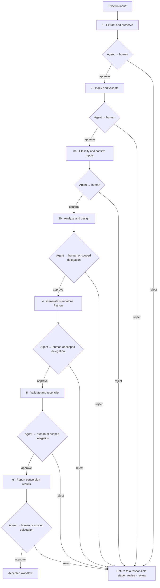

# excel_to_act

English | [简体中文](README.zh-CN.md)

Convert an Excel workbook into a source-bound, reviewable Python workflow through six stages. Each stage pairs machine-readable JSON evidence with a human-readable handoff. The Agent selects tools from the current stage catalog, checks evidence, and reviews the exact handoff before a human reviews it. Only an explicit, current, stage-scoped delegation can replace the human reviewer for eligible later stages; input-boundary confirmation always requires a human decision.

## Workflow



Put the workbook in `input/` and use a new directory under `output/` for each source and run. `workflow status --workflow DIR` shows current evidence and the next permitted stage. Draft creation or a successful tool check does not approve or advance a stage. Changed evidence invalidates affected decisions; rejected history remains in the workflow ledger.

## CLI and deliverables

Run `excel-to-act stepN tools`, `excel-to-act stepN agent`, or `--help` for current commands, limits, and instructions.

| Stage | Main commands | Main deliverables |
| --- | --- | --- |
| 1 · Extract | `step1 convert`, `check`, `finalize`, `report` | Preserved source parts, inventories, `import_checkpoint.json/.md` |
| 2 · Index and read | `step2 index`, `validate`, `prepare`, `query`, `trace`, `report` | Index, source-bound reading package, bounded evidence packets and traces |
| 3 · Analyze and design | `step3 prepare`, `fields`, `dependencies`, `input-catalog`, `query`, `trace`, `source-trace`, `profile`, `plan`, `check`, `report` | Confirmed inputs, targets, source candidates, variables, equations, modules, and `analysis_design.json/.md` |
| 4 · Generate | `step4 capture-external`, `discover`, `plan`, `generate` | Modular standalone bundle, source map, separate input/metadata records, generation report |
| 5 · Validate | `step5 validate`, `oracle`, `reconcile` | Isolated execution evidence, native Excel capture, numerical comparison report |
| 6 · Report | `step6 report`, `skill`, `template` | Human conversion report and JSON evidence |
| Workflow | `workflow status`, `confirm`, `reject`, `delegate`, `typesafe` | Current status and hash-bound decisions |

Step 3 works backward from declared results and confirms scalar, vector, table, raw, and formula-derived input boundaries. Step 4 generates modular code only for supported, bound designs, after the semantic mapping and implementation preflight pass. Check the current tool catalog and source adapter for formula and input-shape limits; the workflow is not a universal Excel compiler. Formula caches are not model inputs, and extraction does not run VBA. Step 4 smoke evidence proves bundle execution only. Native Excel comparison requires Windows and Microsoft Excel. A tested scenario does not establish all-configuration coverage, actuarial certification, feedback solving, or GPU support.

Primary handoffs lead with the decision, scope, verified results, limits, unresolved choices, links to JSON/Markdown evidence, and the next review action. Detailed provenance and history stay in the evidence appendix. Missing facts are unknown or “Not recorded,” never zero. `workflow.json` is the current acceptance ledger.

## Use

Python 3.11+ is required. Install the optional `vba` extra when using the VBA inspection tools.

```powershell
python -m pip install -e ".[vba]"
excel-to-act step1 tools
excel-to-act step1 agent
excel-to-act workflow status --workflow WORKFLOW_DIR
$BUNDLE = "output/WORKFLOW/stage4/bundles/revision-NNNN/bundle"
python "$BUNDLE/model.py" --out "output/result.json"
```

See the [six-step workflow](docs/workflow.md), [CLI guide](docs/cli.md), [generic Agent contracts](docs/design/generic_agent_contracts.md), [result-driven analysis guide](docs/design/result_driven_analysis.md), and [report contract](docs/design/model_conversion_report.md). Source workbooks and run evidence under `input/` and `output/` are local data. The README pair is bilingual; other authored project documentation is in English.
