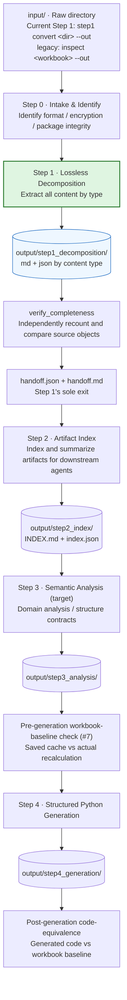
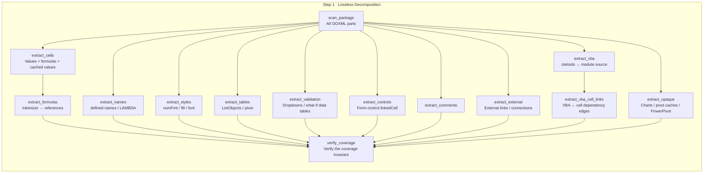

# excel_to_act

English | [简体中文](README.zh-CN.md)

The root README is available in English and Simplified Chinese. All other documentation, code comments, and docstrings are maintained in English.

Excel-to-actuarial-model tooling: **CLI + API + agent-ready**, installable as a skill for any agent.

First principle: **lossless decomposition before understanding and generation**. Anything that cannot be interpreted must be recorded as opaque; silent omission is forbidden.

```text
recognized_inventory_objects + unsupported_or_opaque_objects = discovered_workbook_objects
```

> ⚠️ Scope: `CoverageSummary.discovered_workbook_objects` is populated from the independent OOXML source scan, and the recognized count is based on matched source identities. The summary counts alone do not prove identity-by-identity coverage. Since #5 / [PR #38](https://github.com/ferryhe/excel_to_act/pull/38), legacy `inspect` runs `verify_completeness`, which compares source and inventory identities, validates stored counts, fails on omissions, and exits nonzero. Human Step 1 has its own logical-object and OOXML-part ledgers. These checks do not mean every Excel feature has been semantically parsed. See [the Phase 1.5 backlog and status](docs/issues/backlog.md) and §4 I.

---

## 1. Pipeline overview



**Implementation status**: The legacy single-workbook `inspect` workflow builds a graph, emits rule classifications and human confirmation questions, checks structural completeness, compares saved formula caches with optional `formulas` recalculation, and writes a handoff with separate structural and numerical statuses. The current human Step 1/2 path converts and checks source facts, indexes handoffs, compiles deterministic views, and supports evidence queries/traces. README Step 3 describes a broader semantic target; the existing rule classifications are not that full analysis. Step 2's batch `index.json`/`INDEX.md` differs from legacy `artifact_index.json`. **Python generation and post-generation equivalence remain future work.** See [the layered architecture](docs/design/layered_architecture.md) for current contracts and target boundaries.

The diagram shows the complete target route, including unfinished steps. The current human entry point is `excel-to-act step1 convert <raw-directory> --out <output-directory>`. Legacy `inspect` remains available for the single-workbook Phase 1 workflow.

### Available now: human Step 1 → human Step 2

The new `step1` command accepts a raw directory and recursively records every file. `.xlsx` / `.xlsm` files enter conversion; other formats, damaged files, and unreadable files remain as failed entries. Each input is stored separately by source SHA-256, relative-path key, and run ID. The batch handoff summarizes every input without a root alias for the "last file".

Step 2 indexes that handoff and its per-source references:

```text
excel-to-act step2 agent
excel-to-act step2 tools
excel-to-act step2 index --handoff PATH --step1-root DIR [--out DIR] [--resume]
excel-to-act step2 validate --index output/step2_index/index.json --step1-root DIR
excel-to-act step2 prepare --index output/step2_index/index.json --step1-root DIR --out output/reading [--scope analysis_scope.json] [--resume] [--dry-run]
excel-to-act step2 query --manifest output/reading/manifest.json --source-id SOURCE --kind overview
excel-to-act step2 query --manifest output/reading/manifest.json --source-id SOURCE --kind cell --sheet PremiumTable --target B7
excel-to-act step2 trace --manifest output/reading/manifest.json --source-id SOURCE --kind name --target GP --direction upstream --out trace-packet.json
excel-to-act views validate --views evidence-packet.json --output claims.json
output/step2_index/index.json
output/step2_index/INDEX.md
```

`step2 prepare` validates the saved native index without adding an indexing recovery attempt, then writes a source/run-bound reading package with separate views, static dependency evidence, and paired English handoffs. Without `--scope`, all source sheets are retained. Preparation reads saved inventory and formula facts; it does not execute macros or recalculate formulas. The Step 2 batch index is distinct from the legacy per-workbook `artifact_index.json` shown below.

For progressive evidence reading, select the exact `source_id` from the prepared manifest, query `overview`, then request only the needed sheet, cell, range, name, control, VBA module, or feature. Queries return complete records in bounded pages; a cursor resumes at the next undelivered record. Follow supported dependencies with `step2 trace`: upstream follows formula-cell → referenced-input edges, downstream finds consumers through cells, names and ranges, and both combines them. Defaults depth 8/nodes 100/edges 200 ensure a finite read. Structural derivations keep provenance; unresolved paths, frontier and excluded-sheet boundaries stay explicit. Keep the packet and validate citations with `views validate`. Validation proves provenance only; cached results and VBA declarations do not prove recalculation or execution. See [the exploration specification](docs/design/step2_trace_exploration.md) for replay and independent-review instructions.

If the output directory is inside the input directory, discovery excludes that output subtree and records the excluded path in the batch's `discovery` information. Identical input and output directories produce an explicit error.

```powershell
excel-to-act step1 tools                         # JSON tool catalogue
excel-to-act step1 agent                         # Reusable host-agent definition
excel-to-act step1 convert .\raw --out .\output # Step 1: extract and check facts
excel-to-act step1 check --run <run-dir>         # Reread the current source and check candidate artifacts
excel-to-act step1 coverage --run <run-dir>      # Check logical objects and OOXML parts separately
excel-to-act step1 fidelity --run <run-dir>      # Compare raw XML fields with normalized facts
excel-to-act step1 finalize --run <run-dir>      # Publish the final conversion directory after fresh checks
```

Checkbox, ActiveX, and VBA handoff can also be inspected independently for one workbook. Each family has `identify`, `convert`, and `evaluate` commands; `identify` is read-only, `convert --dry-run` reports its plan without creating or changing output, and `evaluate` freshly extracts source facts and compares them with saved artifacts.

```powershell
excel-to-act step1 checkbox identify .\model.xlsm
excel-to-act step1 checkbox convert .\model.xlsm --out .\controls [--dry-run]
excel-to-act step1 checkbox evaluate .\model.xlsm --out .\controls
excel-to-act step1 activex identify .\model.xlsm
excel-to-act step1 activex convert .\model.xlsm --out .\controls [--dry-run]
excel-to-act step1 activex evaluate .\model.xlsm --out .\controls
excel-to-act step1 vba identify .\model.xlsm
excel-to-act step1 vba convert .\model.xlsm --out .\controls [--dry-run]
excel-to-act step1 vba evaluate .\model.xlsm --out .\controls
```

The default Step 1 handoff writes typed control artifacts, a human-readable `controls_handoff.md`, and separately indexed VBA source files with checksums. Checkbox links such as source `#REF!` values are recorded as invalid rather than guessed. ActiveX event names are associated with worksheet code names and declared VBA procedures statically; macros are not run, and ActiveX binary streams remain opaque. VBA files are readable source handoff, not a translation of Excel runtime behavior.

Default thresholds require 100% logical-object traceability, byte-for-byte OOXML part preservation, and exact agreement for supported facts. Unknown or unparsed parts are still preserved. The default policy reports them as `partial` and allows handoff to Step 2 only after all other checks pass. Use `--no-allow-opaque` to prohibit this handoff. Manually lowering `--fidelity-min` explicitly produces a partial result; it cannot bypass missing supported objects, damaged XML, source changes, or verification errors. Step 1 does not calculate formulas or interpret actuarial meaning. After a person confirms the Step 1 handoff, Step 2 starts indexing and deciding what interpretation work is needed. `inspect <workbook> --out <dir>` retains the original single-workbook Phase 1 behavior.

The parsed and opaque package-part ratios use the same unit (all non-directory OOXML ZIP parts), separately from logical-object coverage. `parsed_coverage_ratio` is the proportion of supported logical objects linked to inventory identities; `parsed_package_parts_ratio` is the proportion of parts read and classified as non-opaque in a fresh scan; `opaque_rate` is the proportion of opaque parts. `--parsed-package-min` and `--opaque-max` both accept `[0,1]` and default to `0` and `1`, respectively, allowing an explicit opaque `partial` handoff. Raising the former or lowering the latter independently tightens package-part requirements. `--no-allow-opaque` always prohibits opaque parts. No numeric threshold can override missing objects, source read/verification errors, or byte-preservation failures.

Each source's quality result and tool responses include `metrics_state`. `measured` means a fresh scan succeeded. `unavailable` means the current source cannot be read or verified: source-derived denominators, counts, ratios, and fidelity differences are JSON `null`. An old report or candidate ledger never substitutes for current measurement. Numeric `0` is used only for a zero actually measured during a successful scan. Unavailable measurement always blocks approval; even zero thresholds cannot allow finalization or promotion.

`raw_value_text`, raw formula text/attributes, cached text, and date serials are verbatim source evidence. Downstream consumers requiring exact numeric text should read `raw_value_text`. Normalized numbers become integers or floats, so long decimals may have floating-point approximation; dates use the workbook's 1900/1904 date system. Formula caches represent only the results saved in the file. Missing caches stay missing, and conversion never recalculates formulas.

These extended source facts have values only after actual Step1 measurement. A `null` in legacy `inspect` output or earlier JSON means unmeasured, rather than `false` or the 1900 date system.

Normalized strings join OOXML body `<t>` and rich-text `<r><t>` elements, excluding `<rPh>` phonetic text and container formatting whitespace. Original worksheet and shared-string parts are still preserved and verified byte for byte.

Each batch produces `batches/<batch-id>/batch_handoff.{json,md}`. Each source has a separate candidate directory containing `source_facts.json`, `logical_objects.json`, `package_parts.json`, `quality.json`, and both handoff formats. Candidates accepted by `finalize` are copied to a unique `final/` directory. Blocked candidates still have a handoff and actionable next steps.

**Next development target: extend Step 1 lossless decomposition** (see the gap list in §4). Directory conversion, independent coverage/fidelity checks, and both handoff formats are already available through the `step1` commands above.

### Mapping to `phase1_excel_decomposition_plan.md`

| README pipeline | Location in the plan |
|---|---|
| Steps 0–3 | **Within the plan's Phase 1 scope** (ingest → inventory → graph → classify → confirm → store → report) |
| Step 4 (generate Python) | Explicitly excluded by the plan's "Non-goals" |
| Workbook-baseline check (#7) | Legacy `inspect` compares saved formula caches with optional `formulas` recalculation and stores `validation_report.json`; missing coverage stays explicit |
| Generated-code equivalence | Separate post-Step-4 comparison against the accepted workbook baseline; future work |

---

## 2. Agents and tools for each step

Tool status: `implemented` means a corresponding implementation exists in `src/`; `target` means not yet implemented and defined in `docs/issues/backlog.md`.

| Step | Agent | Responsibility (capability) | Main tools | Status |
|---|---|---|---|---|
| 0 | `intake-agent` | Identify file authenticity and parseability; report an error when blocked | `scan_ooxml_package` `OpenpyxlWorkbookReader.read_manifest` (`detect_format`/`decrypt_probe` are targets) | Partial |
| **1** | **`decomposition-agent`** | **Extract all content by type without semantic decisions** | See the Step 1 tool diagram below | Partial |
| **1b** | `completeness-agent` | Independently verify output coverage of the input and produce a handoff | `verify_completeness`, `build_handoff`, `render_handoff_markdown` | Implemented |
| 2 | `index-agent` | Index and summarize Step 1 artifacts | `src/excel_to_act/steps/step2/workflow.py:build_index` and its `_write_index` are implemented for `step1.v1` / `step1.batch.v1`, writing batch `index.json` and `INDEX.md`; the separate `summarize_artifacts` helper remains a target. Legacy `src/excel_to_act/store/local_store.py:LocalArtifactStore._write_index` writes per-workbook `artifact_index.json`. | Partial (separate summary helper remains a target) |
| 3 | `analysis-agent` | Classify modules, tag domains, and confirm boundaries | `classify/rules.py`+`classifier.py`, `confirm/templates.py` (implemented) | Partial |
| 4 | `generation-agent` | Generate structured Python with provenance | `emit_module` / `emit_package` (targets) | Target |
| 5 | `validation-agent` | Compare the saved workbook cache with an actual recalculation before generation (#7); check generated-code equivalence separately after Step 4 | Legacy `inspect` has `ValidationReport` and a `formulas` adapter; the broader agent workflow and code-equivalence check remain targets | Partial |

### Step 1 internal flow



Legacy `inspect` populates `CoverageSummary.discovered_workbook_objects` from the independent OOXML source scan, and counts recognized objects by matched source identities. Those summary counts alone do not establish identity-by-identity coverage; `verify_completeness` compares source and inventory identities, validates stored counts, saves mismatch diagnostics, and exits nonzero on omissions ([#5 / PR #38](https://github.com/ferryhe/excel_to_act/pull/38)). The human `step1 coverage` command has separate logical-object and package-part ledgers. Neither path means all Excel features are semantically parsed.

---

## 3. Step 1 output directories

### 3.1 Current implementation

The legacy single-workbook `inspect` CLI is `excel-to-act inspect <workbook> --out <dir>`. If the input is a directory, `inspect` reports a controlled read error and writes diagnostic-only failed-run artifacts. Directory batches use the new `excel-to-act step1 convert` described above. A successful `inspect` run writes seven data JSON files, `run_metadata.json`, and a human-readable `handoff.md`:

```text
<out>/workbooks/<workbook_sha256>/<run_id>/
  workbook_manifest.json
  inventory.json
  dependency_graph.json
  module_classification.json
  confirmation_template.json
  completeness.json
  handoff.json
  handoff.md
  run_metadata.json
<out>/workbooks/<workbook_sha256>/artifact_index.json
<out>/artifact_index.json
<out>/<artifact>               # Convenience alias for the latest run's artifacts, including handoff.md
```

A diagnostic-only failed run writes `workbook_manifest.json`, `completeness.json`, `handoff.json`, `handoff.md`, and `run_metadata.json`, plus the indexes. It does not produce `inventory.json`, `dependency_graph.json`, `module_classification.json`, or `confirmation_template.json`. Root-level aliases reflect only the latest run: aliases for those four absent artifacts are removed on failure, while earlier successful artifacts remain in their canonical per-run directory.

### 3.2 Target layout (Step 1)

- `--input` supports **directories** (batches).
- Keep the `<workbook_sha256>/<run_id>/` namespace, **without a slug**. Filename-derived slugs mix different contents sharing a name and break links when files are renamed.
- Each content type produces both `.md` (for people) and `.json` (for machines).
- The legacy `inspect` workflow's `Handoff` contract is implemented with JSON/Markdown output. Its `CoverageSummary` remains embedded in `WorkbookInventory`; an independent coverage artifact belongs to the legacy target layout. Current directory-based `step1` uses the independent checks and batch handoff described here.

```text
output/step1_decomposition/workbooks/<workbook_sha256>/<run_id>/
  00_manifest.{md,json}         File identity, sha256, format, encryption status
  01_package.{md,json}          All OOXML parts + content type + relation
  02_sheets/                    Sheet name/order/visibility/type/dimensions
  03_cells/                     Cell values, formulas, cached values, number_format
  04_formulas/                  Formula reference graph, including VBA edges
  05_names/                     Defined names, LAMBDA, hidden names
  06_tables/                    ListObjects, structured references, pivot definitions and caches
  07_styles/                    numFmt / font / fill / border / dxfs
  08_conditional_formatting/
  09_validation/                Data validation + what-if data tables (dataTable)
  10_comments/                  Comments and authors
  11_charts/
  12_external/                  externalLinks, connections, Power Query
  13_controls/                  Form-control linkedCell, slicers, timelines
  14_vba/                       Module source + procedure inventory + static call relationships
  15_xlm_macros/                Excel 4.0 macros and DDE
  99_opaque/                    Chart binaries, Power Pivot, OLE, signatures, etc.
  coverage.{md,json}            Legacy inspect target; current step1 coverage has separate logical-object/part ledgers
  handoff.{md,json}             Legacy inspect target; current step1 already writes both handoff formats
```

`handoff.json` is the sole downstream contract: it lists each artifact type's paths, counts, schema versions, and `opaque` summary.

---

## 4. Completing Step 1: completeness checks and handoff

Decomposition **must be checked for completeness before producing the handoff**. This is Step 1's exit and the only entry downstream agents need to read.

`verify_completeness()` in `verify/completeness.py` does not rely on `WorkbookInventory.coverage` totals alone. `discovered_workbook_objects` comes from the independent source scan, but summary counts cannot prove identity-by-identity coverage. The check independently discovers source objects from the package, compares source and inventory identities, validates stored counts, and fails when objects are missing:

| Check | Criterion | Severity |
|---|---|---|
| `sheets_accounted` | Every `<sheet>` in `workbook.xml` has a corresponding `SheetInventory` | error |
| `cells_accounted` | Per-sheet cell counts match an independent worksheet XML scan | error |
| `content_parts_accounted` | Every content part **has output evidence** (e.g. `xl/tables/` requires a `table` range) or is marked opaque | error |
| `formulas_linked` | Every formula cell has an outgoing edge or a `formula_reference_parse` record | warning |
| `metadata_parts_accounted` | Metadata parts such as `docProps/` that are not yet modeled | info |
| `coverage_arithmetic` | Whether recognized/discovered object totals agree with stored coverage counts. Separate per-kind `*_identities` checks match identities and detect missing, unexpected, or duplicate objects; `verify_completeness` runs both. Package parts use a separate ledger. | error |

> A part is considered "collected" based on **corresponding output evidence**, rather than its path prefix. Otherwise, removing extraction logic would not trigger a failed check.

Statuses and consequences:

- `fail`: any error-level check fails → **CLI exit code 1**. Artifacts are still written but must be treated as unusable.
- `warn`: only warning-level checks fail.
- `pass`: every check passes.

Artifacts (run directory `<out>/workbooks/<sha256>/<run_id>/`; `handoff.md` and `handoff.json` are also copied to the `<out>/` root for convenient access):

| File | Audience | Contents |
|---|---|---|
| `completeness.json` | Machines | Checks, expected/actual counts, gaps, blocking_reasons |
| `handoff.json` | Machines | `summary` counts, artifact inventory (path / sha256 / count), coverage, opaque summary, blockers, warnings, next_actions |
| `handoff.md` | **People** | A short English summary of the same information, with `At a glance` / `Blockers` / `Warnings` / `Artifacts` / `Unresolved (opaque)` / `Next steps`. **Assess whether decomposition is trustworthy without opening JSON.** |

The top of `handoff.md` sketches the workbook (sheets / cells / formula cells / cached values / defined names / tables / merged ranges / what-if data tables / form controls / VBA modules / graph nodes and edges) so a person can quickly check the file's identity and scale.

## 5. Step 1 content coverage checklist

**Legend (three states)**

| Label | Meaning |
|---|---|
| `collected` | Present in `inventory.json` |
| `opaque` | Explicitly recorded as unparsed or unsupported; Step 1 also preserves package bytes |
| **silent omission** | Neither collected nor explicitly classified as opaque — violates the hard constraint |

### A. Package and file layer

| Content | OOXML source | Status |
|---|---|---|
| File identity (sha256/size/format) | — | Collected |
| All parts + content type | `[Content_Types].xml` | Collected |
| Document properties | `docProps/*.xml` | **Missing**: should be collected, rather than marked opaque (parseable) |
| Custom XML / Power Query `DataMashup` | `customXml/` | Opaque (markers added; see group I); M code itself is unparsed |
| Digital signatures | `_xmlsignatures/` | Opaque (markers added; see group I) |
| Encrypted / damaged files | `EncryptedPackage` | **Handled as a controlled failure**: PR #37 saves diagnostic-only failed-run artifacts and returns a controlled nonzero CLI exit. No decryption is performed ([Issue #8](https://github.com/ferryhe/excel_to_act/issues/8); [PR #37](https://github.com/ferryhe/excel_to_act/pull/37)) |

### B. Workbook structure layer

| Content | Status |
|---|---|
| Sheet name/order/visibility/dimensions | Collected |
| `calcMode` (manual/auto) | Collected (`WorkbookManifest.calc_mode`) |
| Other `calcPr` fields (iterate / iterateCount / iterateDelta / calcId / fullCalcOnLoad) | **Silent omission** — iterative settings directly determine how circular references are solved |
| `xl/calcChain.xml` (last calculation order) | Opaque package part recorded and byte-preserved by Step 1; calculation order is not interpreted |
| Defined names | Workbook- and sheet-scoped declarations are collected; range destinations expand to bare A1 addresses (one inventory row per area) while inventory metadata retains declaration scope. Step 1's source census counts each declaration once and keeps its raw name text. The `hidden` flag is not collected |
| LAMBDA / custom functions defined in names | Step 1 preserves raw name text, but **LAMBDA detection is missing**, as is reference parsing within name formulas |

### C. Cell content layer

| Content | Status |
|---|---|
| Values / formulas / errors (`#N/A`, `#REF!`) | Collected (errors stored as literals) |
| number_format, data_type, style_id | Collected |
| Blank cells | **Not collected**: `extractor.py:55` immediately executes `continue`; `CellKind.blank` is unused (either collect blanks or remove the enum value) |
| Cached values (`data_only=True`) | **Collected and accepted** ([PR #15](https://github.com/ferryhe/excel_to_act/pull/15) and [PR #16](https://github.com/ferryhe/excel_to_act/pull/16) are merged; [Issue #4](https://github.com/ferryhe/excel_to_act/issues/4) is closed): `cached_value` + `cached_value_available`; `missing_cached_values` warning when the whole workbook lacks cached results. Foundation for a reconciliation oracle |
| `cell.formula_attributes` | Step 1 preserves raw formula text and the complete `<f>` attribute map in `source_facts.json` and `CellInventory`, including shared, array, and `dataTable` attributes. Legacy `inspect` does not populate these raw formula facts; nullable presence and date fields remain unknown. Preserving the attributes does not interpret dynamic-array spill behavior |
| Rich-text runs, phonetic text | **Silent omission** |

### D. Styles and presentation layer (key signals for identifying inputs/outputs)

| Content | Status |
|---|---|
| Merged cells | Collected |
| Row heights, column widths, hidden rows/columns, frozen panes | Collected |
| Sheet protection | Collected |
| Comments (text + author), hyperlinks (target + location) | Collected |
| Conditional formatting | **Ranges** collected; `cfRule` types/dataBar/colorScale/iconSet are not collected |
| fonts / fills / borders / numFmts / dxfs | **Silent omission** |
| Print settings, headers/footers | **Silent omission** |

### E. Structured object layer

| Content | Status |
|---|---|
| Data validation | Ranges + `type`/`formula1`/`formula2` collected; `operator`/`allowBlank`/`showDropDown`/prompt and error messages are missing, and list sources are not resolved to ranges |
| Excel Tables (ListObjects) | `ref`+`name` collected; **column definitions, totalsRow, sort/filter states are not collected** |
| Pivot definitions + cached records | Opaque (`/pivot` is in `OPAQUE_MARKERS`) |
| `xl/connections.xml` | Opaque (`/connections` is included) |
| Slicers / timelines (`xl/slicers/`, `xl/timelines/`) | Recorded as opaque and byte-preserved by Step 1; semantic content is unparsed |
| Power Query `DataMashup` | `customXml/` parts are recorded as opaque and byte-preserved by Step 1; M code is unparsed |

### F. Graphics and controls layer

| Content | Status |
|---|---|
| Charts (including `SERIES()` references) | Opaque (`/charts/` is included) |
| Images / shapes / text-box cell links | Opaque (`/drawings/`, `/media/` are included) |
| Embedded OLE objects | Opaque (`/embeddings/` is included) |
| **Form-control `linkedCell`** (`vmlDrawing` + `ctrlProps`) | Step 1 extracts bound `ClientData` links from `xl/drawings/vmlDrawing*.vml`. A VML part is non-opaque only when every shape has one supported bound `ClientData`; Note/Pict, unbound or missing `ClientData`, and other VML shape objects make the whole part opaque. Supported bindings in a mixed part are still extracted, and the original part is byte-preserved |
| **What-if data tables `dataTable`** | Step 1 reads `<f t="dataTable" ref r1 r2>` directly from worksheet XML and emits a `data_table` range object plus input-cell facts. It preserves source attributes; formulas and table results are not evaluated or recalculated |

### G. Code and automation layer

The `Tool` column distinguishes dependency libraries from in-house parsers.

| Content | Source | Tool | Status |
|---|---|---|---|
| **VBA module source** | `xl/vbaProject.bin` | Dependency `oletools` (olevba) `>=0.60.2`, BSD-3 (verified 2026-10-02; latest PyPI version 0.60.2 / 2024-07-02) | **Extraction path implemented on the current branch** (local task `LOCAL-VBA`; see [PR #15](https://github.com/ferryhe/excel_to_act/pull/15)): `extract_vba_project` produces module source + procedure names; missing oletools degrades to a warning without crashing |
| **VBA ↔ cell dependency edges** | Source from the previous step | In-house `extract_vba_cell_links` → `build_vba_edges` | **Collected**: `FormulaGraph` adds `relationship="vba_ref"` edges in the formula graph's node namespace (new `GraphNodeKind.vba` and `GraphEdge.confidence`) |
| **Excel 4.0 macros (XLM)** | `xl/macrosheets/` | Dependency oletools `olevba` (XLM uses another entry point and needs the optional `XLMMacroDeobfuscator` dependency) | Opaque package part recorded and byte-preserved by Step 1; macro content is not extracted |
| **DDE links** | — | Dependency oletools `msodde` | **Silent omission** |
| **LAMBDA / custom named functions** | Defined names | In-house `extract_names` | Names collected; detection missing |
| **RTD / add-ins** | `volatileDependencies.xml`, `webExtensions/` | In-house `scan_package` | Opaque package parts recorded and byte-preserved by Step 1; add-in behavior is not interpreted |

**Why VBA source must be extracted**: legacy actuarial models commonly drive calculations through `Range("B7")` / `Names("Mort_qx")`. These dependencies are invisible in a formula-only graph, producing a **disconnected dependency graph** (`graph/builder.py` currently does not inspect VBA).

Implementation constraints (fixed to avoid rework):

1. Extracted edges **must be written into `FormulaGraph`**, using `GraphEdge.relationship = "vba_ref"`. **Do not create another contract or edge type**: two node namespaces in `dependency_graph.json` would prevent reference reconciliation from closing.
2. Literal matching misses `Cells(r, c)`, `"B" & i` concatenation, and indirect addressing through variables/named ranges. Results must include `confidence`. Statically unresolved references must be recorded as `vba_ref_unresolved` and sent to confirmation without claiming certainty.

### H. Semantic signal layer

| Content | Status |
|---|---|
| Comments | Collected |
| Data-validation dropdown sources | `formula1` collected; not resolved to ranges |
| What-if data tables | Collected by Step 1 as described in group F; results are not recalculated |
| Grouping/outlines, Excel Scenario Manager | **Silent omission** |
| Solver / Goal Seek (stored in `Solver_*` hidden names + VBA) | **Silent omission** |

### I. Package parts recorded as opaque

`OPAQUE_MARKERS` now includes the following parts. Step 1 records them as opaque and preserves their bytes; the markers do not imply semantic parsing. They are not current silent omissions:

```text
xl/model/                     Power Pivot data model (ABF binary)
_xmlsignatures/               Digital signatures
xl/calcChain.xml              Calculation chain
xl/ctrlProps/                 Form-control properties (linkedCell)
xl/slicers/  xl/timelines/    Slicers / timelines
xl/macrosheets/               Excel 4.0 macros
customXml/                    Power Query / custom XML mappings
xl/volatileDependencies.xml   RTD
webExtensions/                Office add-ins
```

Document properties should be collected directly rather than marked opaque:

```text
docProps/*.xml                Document properties (parseable)
```

What-if data tables are already collected from worksheet XML as described in group F. Opaque recording guarantees preservation, but does not guarantee usability. Continue implementing the remaining semantic gaps in groups A–H as needed. Step 1 already reads cached formula results and supported VML control bindings.

### J. Unparseable content (record as opaque without interpretation)

Power Pivot data models, pivot-cache binaries, chart rendering, embedded media, encrypted content, signatures.

### K. Planning vocabulary and implemented runtime contract

The module-category and actuarial-hint lists in the Phase 1 plan are proposed planning vocabulary, not requirements for runtime enum members. The implemented `ModuleCategory` contract has nine values (`input`, `data_table`, `formula_block`, `lookup_block`, `output`, `presentation`, `external_dependency`, `unsupported_opaque`, `other`); the implemented `ActuarialHint` contract has six (`assumption`, `rate_table`, `cashflow`, `projection`, `output`, `unknown`). Their definitions are in `src/excel_to_act/schemas/artifacts.py:273-292`. The plan lists 12 proposed module labels at `docs/plans/phase1_excel_decomposition_plan.md:67-80` and 10 proposed hint labels at `docs/plans/phase1_excel_decomposition_plan.md:88-97`; these differences do not indicate missing runtime enum values.

---

## 6. Current code layout and directory roadmap

The current Step 1 workflow, its dedicated OOXML source scanner, and the agent definition distributed with the package live in the same business-step package:

```text
src/excel_to_act/
  steps/
    __init__.py
    step1/
      __init__.py
      workflow.py
      source_scan.py
      agent.md
  interfaces/                 CLI entry point, reusing the Step 1 workflow
  ingest/                     Shared file reading and OOXML part capabilities
  inventory/ verify/ graph/   Shared inventory, verification, and graph capabilities
  classify/ confirm/          Shared classification and confirmation capabilities
  schemas/ store/ report/     Shared data contracts, storage, and reporting
  plugins/ orchestrator/      Shared tool contracts / legacy Phase 1 orchestration
tests/
```

Each implemented human business step has an agent definition in `steps/<step>/` and may split implementation files by responsibility. Step 1 separates the conversion workflow and source scanner into two Python files. Step packages reuse existing shared modules without duplicating shared capabilities or creating empty packages for unfinished steps.

### Previously proposed target layout (roadmap reference only)

The directory sketch and notes below retain the earlier roadmap proposal. They describe a future proposal, rather than the current source tree.

```text
excel_to_act/
  src/excel_to_act/          Library core (layering unchanged; normative layer definitions: docs/design/layered_architecture.md)
    interfaces/              CLI + API + agent entry points
    orchestrator/            Step state machine
    plugins/                 Replaceable tool contracts and registry
    ingest/ inventory/ graph/ classify/ confirm/ store/ report/ schemas/
    tools/                   Step 1 tool catalogue (importable, distributed with the package)
      step0_intake/  step1_decomposition/  step2_index/ ...
    validation/              Target workflow: legacy #7 comparison lives in verify/numerical.py; code equivalence comes later
  agents/                    Agent definitions per step: capabilities / tools / IO contracts
    step1_decomposition.agent.md ...
  skills/                    Skill packages installable for external agents
    excel-to-act/SKILL.md
  input/                     Default input directory (CLI accepts any directory; gitignored)
  output/                    Directories by step (gitignored)
    step1_decomposition/ step2_index/ step3_analysis/ step4_generation/ step5_validation/
  schemas/ docs/ examples/ tests/
```

Notes:

- `tools/` **belongs under `src/excel_to_act/`** for packaged capability code, rather than the repository root: `packages.find where = ["src"]` in `pyproject.toml` does not package root-level Python packages. The existing 6 Protocols in `plugins/contracts.py` remain unchanged; the single #7 `formulas` adapter is called directly from `verify/numerical.py`.
- The global `registry` in `plugins/registry.py` is currently **used only by tests**; production modules are not registered yet. Registration remains a target.
- Each file in `agents/` defines fixed capability boundaries, callable tools, input/output artifacts, and prohibitions.
- `skills/` needs `package-data`/`include-package-data` to be included in wheels. That configuration is currently absent and remains to be added.
- `input/` and `output/` are **default locations**; CLI arguments determine the runtime paths.

---

## 7. Phase boundaries

- Human Steps 1–2 perform source decomposition, indexing, deterministic views, and evidence navigation without semantic decisions. Legacy `inspect` separately performs heuristic classification and builds confirmation questions. Phase 1.5 is tracked in [Issue #3](https://github.com/ferryhe/excel_to_act/issues/3); this PR aligns the backlog and closes the Epic once merged.
- README Step 3 is the broader semantic-analysis target. Current legacy classifications use the runtime enums documented in [the layered architecture](docs/design/layered_architecture.md); they do not establish confirmed domain meaning.
- Legacy `inspect` now checks saved formula caches against distinct optional `formulas` recalculation and records unknown cache freshness and uncovered cells. After Step 4, generated-code equivalence is a separate later comparison against the workbook baseline.
- The legacy `inspect` run writes its Phase 1 artifact set by workbook and run ID (see §3.1); human Step 1/2 use their separate source and reading-package contracts. Neither path implements the target directory tree in §3.2.

## See also

- `docs/plans/phase1_excel_decomposition_plan.md` (Phase 1 plan, approximately Steps 0–3 here)
- `docs/plans/pr_plan_phase1.md` (PR breakdown and acceptance criteria)
- `docs/research/excel_tooling_survey.md` (A1: conclusions on existing tools)
- `docs/issues/backlog.md` (Phase 1.5 Epic closeout and Issue source)
