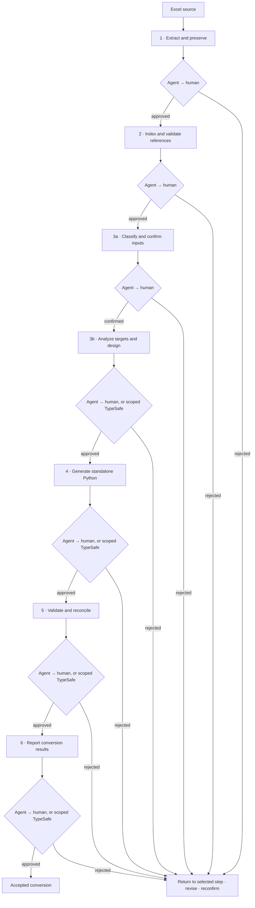

# excel_to_act

English | [简体中文](README.zh-CN.md)

Convert Excel to modular Python through six reviewed steps. Every step produces paired JSON evidence and a readable report. The Agent selects stage tools, explores the current source-bound evidence, checks the results, and reviews the exact pair before the actual human reviews it. A valid, explicitly scoped live TypeSafe delegation may replace the human reviewer for final Step 3 and Steps 4–6; Agent review still comes first, and the input catalog always requires an actual human decision. Ask the user about material ambiguity. Rejection returns to the responsible current or earlier step; changed evidence invalidates affected approvals.

## Workflow



`workflow.json` records versions, evidence hashes, reviewer identities, decisions and return reasons.

Put the source Excel workbook in `input/`. Stage outputs and each source-bound workflow live under `output/`; use a new workflow directory for a new source/run. Each step has an `agent.md` contract and a nonempty `tools/` catalog provider, exposed through `stepN agent` and `stepN tools`. The Agent chooses actions from that catalog and adapts exploration to the current source and request.

Before entering a stage, check `workflow status` for its current upstream evidence and permitted stage. Creating a draft or passing a tool check does not itself approve or advance the workflow. Legacy standalone source-exploration APIs remain available for discovery; they do not create workflow approvals.

## CLI and deliverables

Commands start with `excel-to-act`. Run `stepN tools`, `stepN agent` or `--help` for the current tool contracts, Agent instructions and arguments.

| Step | Main commands | Main deliverables |
| --- | --- | --- |
| 1 · Source | `step1 convert`, `check`, `finalize`, `report` | Preserved workbook parts, source inventories and `import_checkpoint.{json,md}` |
| 2 · Index | `step2 index`, `validate`, `report` | `index.json`, `INDEX.md`, `state.json` and `index_checkpoint.{json,md}` |
| 3 · Analysis and design | `step3 prepare`, `fields`, `dependencies`, `input-catalog`, `query`, `trace`, `source-trace`, `profile`, `plan`, `check`, `report` | Confirmed inputs, source candidate trace/profile, variables/equations/modules, semantic plan/check, `analysis_design.{json,md}` |
| 4 · Code | `step4 capture-external`, `discover`, `plan`, `generate` | Bound external vectors, active source trace, implementation preflight, standalone modular Python, separate input/metadata files and generation report |
| 5 · Verification | `step5 validate`, `oracle`, `reconcile` | Isolated code-validation report, fresh native Excel capture and numerical reconciliation |
| 6 · Delivery | `step6 report`, `step6 skill`, `step6 template`; [$excel-to-act-step6](src/excel_to_act/steps/step6/excel-to-act-step6/SKILL.md) | Human conversion report: results, scope, inputs/modules, reconciliation, limits and run instructions; JSON evidence |
| Review | `workflow status`, `confirm`, `reject`, `delegate`, `typesafe` | Current workflow state and separate, hash-bound review decisions |

Step 3 works backward from a scalar, several values or a column. It first confirms scalar/vector/table inputs and source locations, then describes paths, alternatives, equations, recurrence order and grouping. Formula-derived intermediates may become approved external inputs. `source-trace` and `profile --source-trace` support a new workbook without Step 4 history; static candidates and unresolved lookups remain distinct from runtime evidence. Final design approval is separate from input confirmation.

Step 4 produces logical-variable and recurrence code. Step 5 independently runs it and compares declared results with a fresh Excel calculation. Step 6 leads with results and explains the model, reconciliation and handover; detailed audit evidence goes in appendices. Formula caches are never inputs; extraction does not run VBA. Known-scenario coverage does not imply all-configuration or GPU support.

## Reports and handoffs

Every primary checkpoint leads with what the person is accepting, its purpose and scope, verified results, limits and open choices, links to its JSON and Markdown handoffs, and the next review action. Detailed formulas, source coordinates, question dispositions and hashes stay in the evidence appendix and JSON. Cell coordinates are provenance; input counts describe logical business objects. Missing facts are “Not recorded” or unknown, never zero. Step 3 design is planning evidence, Step 4 smoke is generated-code execution, and only Step 5 provides the separate native Excel comparison. Results are labeled as requested targets only when the bound design supports that classification; other values remain named checks or diagnostics.

## Current implementation and status

Pricing: **Steps 1–6 are accepted for the unchanged saved GP case.** The final human report, revision 4, has independent review PASS plus Agent and delegated TypeSafe acceptance. The existing source, input, design, code and validation approvals remain recorded in the workflow.

Inputs: **44 business objects — 18 scalars, 24 vectors and two sparse tables; 39 raw objects and five external CI curves.** Source tabs: Main 18, Qtable 22, Premium 2, AMR_Table 2. The model has 88 variables, including 44 derived variables, and 76 equation-family functions with ordered projection passes.

Native Excel reconciliation: **GP = 2.7283284514524744**; 8,507/8,507 formula identities and values, 4/4 result checks, 530/530 CI values/formula cuts, 106/106 age keys and 7/7 numerical routes pass. There are zero mismatches at absolute/relative `1e-12`; maximum absolute difference is `2.220446049250313e-16`. [Workflow](output/stage36_20261008/workflow.json) is the acceptance ledger.

Deliverables: [final human conversion report](output/stage36_20261008/stage6/revision-0004/conversion_report.md), [confirmed inputs](output/stage36_20261008/stage3/revision-0022/input_boundary.md), [analysis/design](output/stage36_20261008/stage3/revision-0025/analysis_design.md), [pricing code](output/stage36_20261008/stage4/bundles/revision-0006/bundle/pricing.py), [portable Python bundle](output/gp_source_analysis_20261009/delivery/gp_python_saved_case.zip), and [validation/reconciliation](output/stage36_20261008/stage5/revision-0006/validation_report.md).

This delivery covers the unchanged saved GP case. [WaiverOfPrem is disabled](docs/plans/gp_waiver_scope.md): `Main!F40:F45=None`, with zero waiver payouts and costs. Source extraction remains partial; opaque parts and invalid checkbox bindings are retained. Other parameters, upstream CI algorithms, a feedback solver and GPU execution are outside the accepted scope.

## Use

Python 3.11+ is required. Native Excel reconciliation requires Windows and Microsoft Excel.

```powershell
python -m pip install -e ".[vba]"
excel-to-act step1 tools
excel-to-act step1 agent
excel-to-act workflow status --workflow DIR
python output/stage36_20261008/stage4/bundles/revision-0006/bundle/model.py --out output/gp_result.json
```

See the [six-step contracts](docs/plans/step3_step6_workflow.md), [generic Agent rules](docs/design/generic_agent_contracts.md), [human report structure](docs/design/model_conversion_report.md), [case and manual checks](docs/examples/pricing_conversion_case.md), and [Step 3 CLI guide](docs/step3_cli.md). Local data/reports are Git-ignored under `input/` and `output/`. Only this README pair is bilingual; other project artifacts are English, with source labels preserved.
