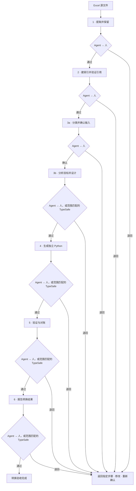

# excel_to_act

[English](README.md) | 简体中文

通过六个审阅步骤将 Excel 转为模块化 Python。每一步都有成对的 JSON 证据和可读报告。Agent 选择步骤工具、探索当前来源绑定的证据、检查结果，并先审阅确切的报告文件，之后才由实际用户审阅。只有在本流程中已有明确且范围匹配的 TypeSafe 委托时，才可替代 Step 3 最终设计和 Step 4–6 的人工审阅；仍须先由 Agent 审阅，Step 3 输入边界阶段始终要求实际人工确认。遇到重要歧义时询问用户。退回后返回当前或更早的责任步骤；证据变化会使相关确认失效。

## 流程



`workflow.json` 记录版本、证据校验值、审阅者身份、决定和退回原因。

将源 Excel 工作簿放入 `input/`。步骤输出和每个来源绑定流程放在 `output/`；新来源或运行应使用新的流程目录。每一步都包含 `agent.md` 约定及非空的 `tools/` 工具目录，通过 `stepN agent` 和 `stepN tools` 提供。Agent 根据当前来源和请求选择工具并灵活探索。

进入每一步前，请运行 `workflow status`，检查上游证据是否仍然有效以及当前允许进入的阶段。创建草稿或工具检查通过本身不会批准或推进流程。旧版独立来源探索 API 仍可用于发现和检查，但不会记录流程批准。

旧版 `inspect` 命令仍可用于单工作簿结构检查和可选数值验证。`formulas` oracle 需要单独选择安装。

## CLI 与交付物

命令均以 `excel-to-act` 开头。运行 `stepN tools`、`stepN agent` 或 `--help` 查看当前工具约定、Agent 指令和参数。

| 步骤 | 主要命令 | 主要交付物 |
| --- | --- | --- |
| 1 · 源事实 | `step1 convert`、`check`、`finalize`、`report` | 保留的工作簿部件、源清单和 `import_checkpoint.{json,md}` |
| 2 · 索引与读取 | `step2 index`、`validate`、`report`、`prepare`、`query`、`trace` | `index.json`、`INDEX.md`、`state.json`、读取包、有界证据包和依赖轨迹 |
| 3 · 分析与设计 | `step3 prepare`、`fields`、`dependencies`、`input-catalog`、`query`、`trace`、`source-trace`、`profile`、`plan`、`check`、`report` | 已确认输入、源候选轨迹及公式族、变量/方程/模块、语义映射及检查、`analysis_design.{json,md}` |
| 4 · 代码 | `step4 capture-external`、`discover`、`plan`、`generate` | 已绑定的外部向量、活跃源轨迹、实现预检、模块化独立 Python、分开的输入/元数据文件和生成报告 |
| 5 · 验证 | `step5 validate`、`oracle`、`reconcile` | 隔离代码验证报告、Excel 新算基准和数值对账 |
| 6 · 交付 | `step6 report`、`step6 skill`、`step6 template`；[$excel-to-act-step6](src/excel_to_act/steps/step6/excel-to-act-step6/SKILL.md) | 面向人的转换报告：结果、范围、输入/模块、对账、限制及运行方式；JSON 证据 |
| 审阅 | `workflow status`、`confirm`、`reject`、`delegate`、`typesafe` | 当前流程状态及分别绑定文件校验值的审阅决定 |

Step 3 从一个值、多个值或一列结果倒推。先确认标量、向量、表格输入及源位置，再说明路径、分支、方程、递推顺序和分组。经确认的中间计算可以改为外部输入。`source-trace` 和 `profile --source-trace` 可用于没有 Step 4 历史的新工作簿；静态候选、未解析查表与运行证据分别记录。最终设计需要独立于输入确认的审批。

Step 4 生成逻辑变量与递推代码。Step 5 独立运行，并与 Excel 新算结果比较。Step 6 先展示结果，再说明模型、对账和交接，详细审计证据放入附录。公式缓存不作为输入；提取阶段不运行 VBA。已知场景覆盖不代表所有参数组合或 GPU 支持。

## 报告与交接

每份主要检查点报告先说明需要接受的内容、用途和范围、已验证结果、限制和未决选择，并链接对应的 JSON、Markdown 交接文件及下一步审阅操作。公式、源坐标、问题答复和校验值保留在证据附录与 JSON 中。单元格坐标用于追溯；输入数量表示逻辑业务对象。缺失事实写为“未记录”或未知，不能写成零。Step 3 设计是计划证据，Step 4 冒烟测试只验证生成代码运行，只有 Step 5 提供独立的原生 Excel 对比。只有绑定的设计支持时才把数值标为请求目标；其他数值标记为命名检查或诊断值。

## 当前实现与状态

Pricing：**Step 1–6 已全部接受，范围为未改参数的保存 GP 场景。** 第 4 版最终人工可读报告已通过独立审阅，并由 Agent 和受委托的 TypeSafe 接受。已有的来源、输入、设计、代码及验证确认继续保留在流程记录中。

输入：**44 个业务对象——18 个标量、24 个向量、2 个稀疏表；其中 39 个原始对象、5 个外部 CI 曲线。** 来源为 Main 18 个、Qtable 22 个、Premium 2 个、AMR_Table 2 个。模型包含 88 个变量，其中 44 个为计算变量；76 个公式族函数按投影步骤和时间顺序计算。

原生 Excel 对账：**GP = 2.7283284514524744**；公式身份及数值 8,507/8,507、结果检查 4/4、CI 数值及公式边界 530/530、年龄索引 106/106、数值路径 7/7 均通过。在绝对/相对误差 `1e-12` 下差异为 0，最大绝对差为 `2.220446049250313e-16`。[Workflow](output/stage36_20261008/workflow.json) 是确认记录。

交付物：[最终人工可读转换报告](output/stage36_20261008/stage6/revision-0004/conversion_report.md)、[已确认输入](output/stage36_20261008/stage3/revision-0022/input_boundary.md)、[分析设计](output/stage36_20261008/stage3/revision-0025/analysis_design.md)、[计算代码](output/stage36_20261008/stage4/bundles/revision-0006/bundle/pricing.py)、[独立 Python 包](output/gp_source_analysis_20261009/delivery/gp_python_saved_case.zip)和[验证对账报告](output/stage36_20261008/stage5/revision-0006/validation_report.md)。

本次交付覆盖未改参数的保存 GP 场景。[WaiverOfPrem 暂不启用](docs/plans/gp_waiver_scope.md)：`Main!F40:F45=None`，豁免保费给付和成本均为零。源提取仍为部分解析，未解析部件及无效复选框引用保留。其他参数、CI 上游算法、反馈求解和 GPU 执行不在已接受范围内。

## 使用

需要 Python 3.11+。原生 Excel 对账需要 Windows 和 Microsoft Excel。

```powershell
python -m pip install -e ".[vba]"
excel-to-act step1 tools
excel-to-act step1 agent
excel-to-act workflow status --workflow DIR
python output/stage36_20261008/stage4/bundles/revision-0006/bundle/model.py --out output/gp_result.json
```

参见[六步工具约定](docs/plans/step3_step6_workflow.md)、[通用 Agent 规则](docs/design/generic_agent_contracts.md)、[人工可读报告结构](docs/design/model_conversion_report.md)、[当前案例与人工检查](docs/examples/pricing_conversion_case.md)和[Step 3 CLI 指南](docs/step3_cli.md)。本地数据及报告保存在被 Git 忽略的 `input/`、`output/` 中。仅此 README 中英文版本为双语；其他项目产物为英语，源标签保留原文。
