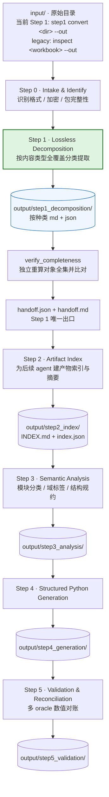
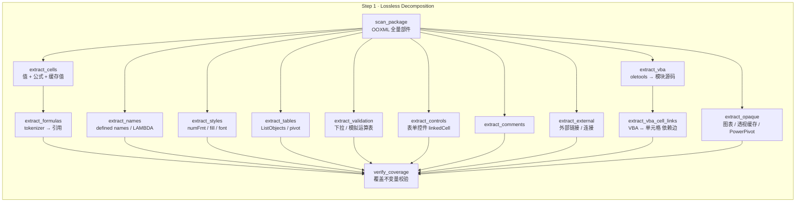

# excel_to_act

[English](README.md) | 简体中文

项目 README 提供英文和简体中文版；其他文档、代码注释和 docstring 统一使用英文。

Excel-to-actuarial-model tooling：**CLI + API + agent-ready**，可按 skill 安装给任意 agent 使用。

第一原则：**先做无损分解（lossless decomposition），再做理解与生成**。任何读不懂的东西必须记为 opaque，禁止静默丢弃。

```text
recognized_inventory_objects + unsupported_or_opaque_objects = discovered_workbook_objects
```

> ⚠️ 范围说明：上述全局不变量**在旧 `inspect` 流程中尚未真正生效**——`inventory/extractor.py:100` 把 `discovered` 直接写成 `recognized + opaque`，是恒等式；且一批部件既未采集也未标 opaque（见 §4 的"静默丢失"）。当前人工 Step 1 `step1 convert` 会独立复核本页声明的支持对象和 OOXML 部件范围；它不代表所有 Excel 功能都已语义解析。旧流程缺口仍见 `docs/issues/backlog.md` issue #5 与 §4 I。

---

## 1. 流水线总览



**落地状态**：Step 0–2 已部分落地（人工 Step 1 位于 `steps/step1/`；共享模块位于 `ingest/` `inventory/` `graph/` `classify/` `confirm/` `store/` `orchestrator/` `interfaces/`）。Step 2 另提供批次导航索引，默认写入 `output/step2_index/index.json` 和 `INDEX.md`；它与 `store/local_store.py` 生成的旧版单工作簿 `artifact_index.json` 是不同文件。Step 3 属 plan 的 Phase 1 范围、已部分落地（`classify/`）。Step 1 的 JSON 与 Markdown handoff 已实现；**Step 4–5 未开工**。

上图展示完整目标路线，包含尚未完成的步骤；当前人工入口是 `excel-to-act step1 convert <raw-directory> --out <output-directory>`，旧 `inspect` 仍用于单工作簿 Phase 1 流程。

### 当前可用：人工 Step 1 → 人工 Step 2

新的 `step1` 命令接收原始目录，递归记录每个文件；`.xlsx` / `.xlsm` 进入转换，其它格式、损坏或无法读取的文件会保留为失败条目。每个输入按源 SHA-256、相对路径键和运行 ID 分开存放，批次 handoff 汇总全部输入，不使用“最后一个文件”的根目录别名。

Step 2 会为该 handoff 及其单源引用建立索引：

```text
excel-to-act step2 agent
excel-to-act step2 tools
excel-to-act step2 index --handoff PATH --step1-root DIR [--out DIR] [--resume]
excel-to-act step2 validate --index output/step2_index/index.json --step1-root DIR
output/step2_index/index.json
output/step2_index/INDEX.md
```

Step 2 批次索引与下文旧版单工作簿 `artifact_index.json` 不同。

若输出目录位于输入目录之内，目录扫描会排除该输出子树，并在批次 `discovery` 信息中记录排除路径；输入目录与输出目录完全相同时会明确报错。

```powershell
excel-to-act step1 tools                         # JSON 工具目录
excel-to-act step1 agent                         # 可复用的 host-agent 定义
excel-to-act step1 convert .\raw --out .\output # 第一步：事实提取与检查
excel-to-act step1 check --run <run-dir>         # 重新读取当前源文件并检查候选产物
excel-to-act step1 coverage --run <run-dir>      # 分别检查逻辑对象与 OOXML 部件
excel-to-act step1 fidelity --run <run-dir>      # 比较原始 XML 字段与标准化事实
excel-to-act step1 finalize --run <run-dir>      # 通过新检查后发布最终转换目录
```

默认门槛是 100% 逻辑对象可追溯、OOXML 部件逐字节保存、已支持事实精确一致。未知或未解析部件仍会保存；默认策略把它们报告为 `partial`，并只在其它检查通过后允许进入 Step 2。可以用 `--no-allow-opaque` 禁止这种交接。手动设置较低的 `--fidelity-min` 会明确产生 partial 结果；它不能绕过缺失的支持对象、损坏 XML、源文件变化或校验错误。Step 1 不计算公式、不判断精算含义；人确认 Step 1 handoff 后，Step 2 才开始建立索引并决定后续解释工作。`inspect <workbook> --out <dir>` 保持原来的单工作簿 Phase 1 行为。

包部件的解析比例和 opaque 比例使用同一单位（所有非目录 OOXML ZIP 部件），并与逻辑对象覆盖率分开：`parsed_coverage_ratio` 是已关联到 inventory 身份的支持逻辑对象比例，`parsed_package_parts_ratio` 是 fresh scan 中已读取且非 opaque 的部件比例，`opaque_rate` 是 opaque 部件比例。`--parsed-package-min` 和 `--opaque-max` 都接受 `[0,1]`，默认分别为 `0` 和 `1`，允许显式的 opaque `partial` 交接；提高前者或降低后者可以独立收紧包部件要求。`--no-allow-opaque` 无条件禁止 opaque 部件，任何数值门槛都不能覆盖缺失对象、源读取/校验错误或字节保存失败。

每个源文件的质量结果和工具响应都带有 `metrics_state`。`measured` 表示已成功 fresh scan；`unavailable` 表示当前源文件无法读取或校验，源派生的分母、计数、比例和保真差异会写成 JSON `null`，不会用旧报告或候选 ledger 代替当前测量。只有成功扫描后实测得到的零才写为数字 `0`；未能测量始终阻止放行，即使配置门槛为零也不能 finalize 或晋升。

`raw_value_text`、原始公式文本/属性、缓存文本和日期序列是源文件原文证据；下游若要求精确数值文本，应读取 `raw_value_text`。标准化数值会转换为整数或浮点数，长小数可能有浮点近似；日期按工作簿的 1900/1904 日期系统转换。公式缓存只表示文件中保存的结果，缺失缓存保持为缺失，转换过程不会重新计算公式。

这些扩展源事实只有 Step1 扫描实际测量后才有值；旧 `inspect` 输出或早期 JSON 中的 `null` 表示未测量，不表示 `false` 或 1900 日期系统。

字符串的标准化值拼接 OOXML 正文 `<t>` 与富文本 `<r><t>`，不把 `<rPh>` 注音或容器排版空白并入单元格文字；原始工作表和共享字符串部件仍按原字节保留并校验。

每批生成 `batches/<batch-id>/batch_handoff.{json,md}`，每个源文件有独立候选目录，其中包括 `source_facts.json`、`logical_objects.json`、`package_parts.json`、`quality.json` 和双格式 handoff。通过 `finalize` 的候选复制到唯一的 `final/` 目录；被阻断的候选仍有 handoff 和可操作的下一步建议。

**后续建造目标：Step 1 的无损分解扩展**（见 §4 的缺口清单）；目录式转换、独立覆盖/保真检查与双格式 handoff 已可通过上面的 `step1` 命令使用。

### 与 `phase1_excel_decomposition_plan.md` 的映射

| README 流水线 | plan 中的位置 |
|---|---|
| Step 0–3 | **plan Phase 1 范围内**（ingest → inventory → graph → classify → confirm → store → report） |
| Step 4（生成 Python） | plan 「Non-goals」明确排除 |
| Step 5（对账） | plan 仅提到 LibreOffice/xlwings 未来 oracle，未排期 |

---

## 2. 每一步的 agent 与 tools

工具名后的状态：`已实现` = `src/` 内有对应实现；`目标` = 尚未实现，定义在 `docs/issues/backlog.md`。

| Step | Agent | 职责（capability） | 主要 Tools | 状态 |
|---|---|---|---|---|
| 0 | `intake-agent` | 识别文件真伪与可解析性，阻断则报 error | `scan_ooxml_package` `OpenpyxlWorkbookReader.read_manifest`（`detect_format`/`decrypt_probe` 目标） | 部分 |
| **1** | **`decomposition-agent`** | **按内容类型全覆盖分类提取，不做语义判断** | 见下方 Step 1 工具图 | 部分 |
| **1b** | `completeness-agent` | 独立验证输出是否覆盖输入，产出 handoff | `verify_completeness`、`build_handoff`、`render_handoff_markdown` | 已实现 |
| 2 | `index-agent` | 为 Step 1 产物建索引与摘要 | `_write_index`（已实现）；`build_index`/`summarize_artifacts` 目标 | 部分 |
| 3 | `analysis-agent` | 模块分类、域标签、边界确认 | `classify/rules.py`+`classifier.py`、`confirm/templates.py`（已实现） | 部分 |
| 4 | `generation-agent` | 生成结构化 Python（保留溯源） | `emit_module` / `emit_package`（目标） | 目标 |
| 5 | `validation-agent` | 多 oracle 数值回归与对账 | `cached_value` / `formulas_oracle` / `libreoffice_oracle`（目标，issue #7） | 目标 |

### Step 1 内部流程



旧 `inspect` 流程的 `verify_coverage` **尚不存在**：该流程的 `CoverageSummary.discovered` 是 `recognized + opaque` 的恒等式，不能作为独立覆盖率。当前 `step1 coverage` 命令使用 OOXML 源清单和输出身份单独核对逻辑对象与包部件。

---

## 3. Step 1 输出目录

### 3.1 当前实现

旧单工作簿 `inspect` CLI 是 `excel-to-act inspect <workbook> --out <dir>`，且 `dir_okay=False`——该命令不接受目录入参；目录批次由上文新增的 `excel-to-act step1 convert` 处理。每次 `inspect` 运行写出七个数据 JSON、`run_metadata.json` 和供人阅读的 `handoff.md`：

```text
<out>/workbooks/<workbook_sha256>/<run_id>/
  workbook_manifest.json
  inventory.json
  dependency_graph.json
  module_classification.json
  confirmation_template.json
  completeness.json
  handoff.json
  handoff.md
  run_metadata.json
<out>/workbooks/<workbook_sha256>/artifact_index.json
<out>/artifact_index.json
<out>/<artifact>               # 最新运行产物的便捷别名（包括 handoff.md）
```

根目录会复制最新运行的产物作为便捷别名；`handoff.md` 和 `handoff.json` 也会复制到根目录。

### 3.2 目标布局（Step 1）

- `--input` 支持**目录**（批量）
- 命名空间沿用 `<workbook_sha256>/<run_id>/`，**不用 slug**：slug 由文件名派生，同名不同内容会串、改名会断链
- 每一类同时产出 `.md`（人读）与 `.json`（机器读）
- 旧 `inspect` 流程的 `Handoff` 契约已实现并写出 JSON/Markdown；其 `CoverageSummary` 仍嵌在 `WorkbookInventory` 中，独立 coverage 产物属于旧目标布局。当前目录式 `step1` 使用本节所述独立检查与批次 handoff。

```text
output/step1_decomposition/workbooks/<workbook_sha256>/<run_id>/
  00_manifest.{md,json}         文件身份、sha256、格式、加密状态
  01_package.{md,json}          OOXML 全量部件 + content type + relation
  02_sheets/                    sheet 级：名称/顺序/可见性/类型/维度
  03_cells/                     单元格：值、公式、缓存值、number_format
  04_formulas/                  公式引用图（含 VBA 边）
  05_names/                     defined names、LAMBDA、隐藏名称
  06_tables/                    ListObjects、结构化引用、pivot 定义与缓存
  07_styles/                    numFmt / font / fill / border / dxfs
  08_conditional_formatting/
  09_validation/                数据验证 + 模拟运算表（dataTable）
  10_comments/                  批注与作者
  11_charts/
  12_external/                  externalLinks、connections、Power Query
  13_controls/                  表单控件 linkedCell、切片器、时间线
  14_vba/                       模块源码 + 过程清单 + 静态调用关系
  15_xlm_macros/                Excel 4.0 宏与 DDE
  99_opaque/                    图表二进制、Power Pivot、OLE、签名等
  coverage.{md,json}            旧 inspect 目标布局；当前 step1 coverage 另有独立逻辑对象/部件账本
  handoff.{md,json}             旧 inspect 目标布局；当前 step1 已写出双格式 handoff
```

`handoff.json` 是唯一被下游消费的契约：列出每类产物的路径、条数、schema 版本、以及 `opaque` 摘要。

---

## 4. Step 1 收尾：完备性检查与 handoff

分解结束后 **必须先做完备性检查，再产出 handoff**。这是 Step 1 的出口，也是下游 agent 唯一需要读的入口。

`verify/completeness.py` 的 `verify_completeness()` **不复用** `WorkbookInventory.coverage`——它的 `discovered` 是 `recognized + opaque` 的恒等式，证明不了任何事。而是**直接从包里重算对象全集**（worksheet XML 数非空单元格 + 枚举包部件），再与产出比对：

| 检查 | 判据 | 严重级 |
|---|---|---|
| `sheets_accounted` | `workbook.xml` 里每个 `<sheet>` 都有对应 `SheetInventory` | error |
| `cells_accounted` | 每表单元格数与 worksheet XML 的独立扫描一致 | error |
| `content_parts_accounted` | 每个内容部件**有产出证据**（如 `xl/tables/` 必须存在 `table` 类型的 range）或已标 opaque | error |
| `formulas_linked` | 每个公式格有出边，或有 `formula_reference_parse` 记录 | warning |
| `metadata_parts_accounted` | `docProps/` 等尚未建模的元数据部件 | info |
| `coverage_arithmetic` | `recognized + opaque` 是否等于独立重算的 `discovered` | info |

> 部件是否"已采集"不看路径前缀，而看**产出里有没有对应证据**——否则哪天采集逻辑被删掉，检查也不会报警。

状态与后果：

- `fail`：任一 error 级未过 → **CLI 退出码 1**；产物照写，但必须视为不可用
- `warn`：仅 warning 级未过
- `pass`：全部通过

产物（run 目录 `<out>/workbooks/<sha256>/<run_id>/`；`handoff.md` 与 `handoff.json` 同时复制一份到 `<out>/` 根，便于直接找到）：

| 文件 | 给谁看 | 内容 |
|---|---|---|
| `completeness.json` | 机器 | 检查项、期望/实际、gaps、blocking_reasons |
| `handoff.json` | 机器 | `summary` 计数、产物清单（路径 / sha256 / 条数）、coverage、opaque 汇总、blockers、warnings、next_actions |
| `handoff.md` | **人** | 同一份信息的简短英文摘要，包含 `At a glance` / `Blockers` / `Warnings` / `Artifacts` / `Unresolved (opaque)` / `Next steps`。**不打开任何 JSON 就能判断本次分解能否被信任** |

`handoff.md` 顶部是工作簿速写（工作表 / 单元格 / 公式格 / 缓存值 / 已定义名称 / 表 / 合并区 / 模拟运算表 / 表单控件 / VBA 模块 / 依赖图节点与边），供人快速核对"是不是我那个文件、规模对不对"。

## 5. Step 1 全覆盖分类清单

**图例（三态）**

| 标记 | 含义 |
|---|---|
| `已采集` | 已进 `inventory.json` |
| `opaque` | 明确记录为未解析或不支持；Step 1 还会逐字节保存包部件 |
| **静默丢失** | 既未采集也未明确标记为 opaque —— 违反硬约束 |

### A. 包与文件层

| 内容 | OOXML 源 | 状态 |
|---|---|---|
| 文件身份（sha256/大小/格式） | — | 已采集 |
| 全量部件 + content type | `[Content_Types].xml` | 已采集 |
| 文档属性 | `docProps/*.xml` | **缺失**：应采集，不是标 opaque（可解析） |
| 自定义 XML / Power Query `DataMashup` | `customXml/` | opaque（token 已补，见 I 组）；M 代码本身未解析 |
| 数字签名 | `_xmlsignatures/` | opaque（token 已补，见 I 组） |
| 加密 / 损坏文件 | `EncryptedPackage` | **已确认违反硬约束**：`ingest/ooxml_package.py:51` 的 `ZipFile()` 无异常保护，会抛未捕获异常（issue #8，P0）。要求：报 error，不 panic |

### B. 工作簿结构层

| 内容 | 状态 |
|---|---|
| sheet 名称/顺序/可见性/维度 | 已采集 |
| `calcMode`（manual/auto） | 已采集（`WorkbookManifest.calc_mode`） |
| `calcPr` 其余（iterate / iterateCount / iterateDelta / calcId / fullCalcOnLoad） | **静默丢失** —— 循环迭代设置，直接关系循环引用怎么解 |
| `xl/calcChain.xml`（最后计算顺序） | Step 1 会记录为 opaque 并逐字节保存；不会解析计算顺序 |
| defined names | 工作簿级和工作表级名称都会采集；区域目标会展开为不带工作表前缀的 A1 地址（每个区域一行），inventory 元数据保留声明作用域。Step 1 源清单按声明计数并保留原始名称文本。`hidden` 标志未采集 |
| LAMBDA / 名称里定义的自定义函数 | Step 1 会保留原始名称文本，但**尚未判定 LAMBDA**，也未解析名称公式里的引用 |

### C. 单元格内容层

| 内容 | 状态 |
|---|---|
| 值 / 公式 / 错误值（`#N/A`、`#REF!`） | 已采集（错误值以字面量存） |
| number_format、data_type、style_id | 已采集 |
| 空单元格 | **未采集**：`extractor.py:55` 直接 `continue`；`CellKind.blank` 是死枚举（要么采集，要么删枚举） |
| 缓存值（`data_only=True`） | **已采集并验收**（[PR #15](https://github.com/ferryhe/excel_to_act/pull/15) 与 [PR #16](https://github.com/ferryhe/excel_to_act/pull/16) 已合入；[Issue #4](https://github.com/ferryhe/excel_to_act/issues/4) 已关闭）：`cached_value` + `cached_value_available`；整簿无缓存值时产出 `missing_cached_values` warning。对账 oracle 的基石 |
| `cell.formula_attributes` | Step 1 会在 `source_facts.json` 和 `CellInventory` 中保存原始公式文本与完整 `<f>` 属性，包括 shared、array 和 `dataTable` 属性。旧 `inspect` 不填充这些原始公式事实；可空的存在性和日期字段仍为未知。保存属性不等于解释动态数组 spill 行为 |
| 富文本 runs、phonetic | **静默丢失** |

### D. 样式与呈现层（识别 input/output 的关键信号）

| 内容 | 状态 |
|---|---|
| 合并单元格 | 已采集 |
| 行高列宽、隐藏行列、冻结窗格 | 已采集 |
| 保护（sheet 级） | 已采集 |
| 批注（文本+作者）、超链接（target+location） | 已采集 |
| 条件格式 | 已采集**范围**；`cfRule` 类型/dataBar/colorScale/iconSet 未采集 |
| fonts / fills / borders / numFmts / dxfs | **静默丢失** |
| 打印设置、页眉页脚 | **静默丢失** |

### E. 结构化对象层

| 内容 | 状态 |
|---|---|
| 数据验证 | 已采集：范围 + `type`/`formula1`/`formula2`；缺 `operator`/`allowBlank`/`showDropDown`/prompt+error 文案，且 list 型来源未解析成区域 |
| Excel Tables（ListObjects） | 已采集 `ref`+`name`；**列定义、totalsRow、排序/筛选态未采集** |
| 透视表定义 + 缓存记录 | opaque（`/pivot` 在 `OPAQUE_MARKERS` 内） |
| `xl/connections.xml` | opaque（`/connections` 在内） |
| 切片器 / 时间线（`xl/slicers/`、`xl/timelines/`） | Step 1 会记录为 opaque 并逐字节保存；尚未解析其语义内容 |
| Power Query `DataMashup` | Step 1 会将 `customXml/` 部件记录为 opaque 并逐字节保存；M 代码未解析 |

### F. 图形与控件层

| 内容 | 状态 |
|---|---|
| 图表（含 `SERIES()` 引用） | opaque（`/charts/` 在内） |
| 图片 / 形状 / 文本框的单元格链接 | opaque（`/drawings/`、`/media/` 在内） |
| OLE 嵌入对象 | opaque（`/embeddings/` 在内） |
| **表单控件 `linkedCell`**（`vmlDrawing` + `ctrlProps`） | Step 1 会从 `xl/drawings/vmlDrawing*.vml` 提取有绑定的 `ClientData`。只有每个 shape 都有一个受支持且已绑定的 `ClientData` 时，该 VML 部件才算非 opaque；Note/Pict、未绑定或缺少 `ClientData`，以及其它 VML 图形对象会使整个部件标为 opaque。混合部件中的受支持绑定仍会提取，原部件会逐字节保存 |
| **模拟运算表 `dataTable`** | Step 1 会从 worksheet XML 直接读取 `<f t="dataTable" ref r1 r2>`，并生成 `data_table` 范围对象和输入格事实。它保存源属性，但不会计算公式或重新计算模拟运算结果 |

### G. 代码与自动化层

`工具` 列区分 `依赖库` 与 `自研解析器`。

| 内容 | 源 | 工具 | 状态 |
|---|---|---|---|
| **VBA 模块源码** | `xl/vbaProject.bin` | 依赖库 `oletools`(olevba) `>=0.60.2`，BSD-3（核实于 2026-10-02，PyPI 最新 0.60.2 / 2024-07-02） | **当前分支已实现提取路径**（本地任务 `LOCAL-VBA`，见 [PR #15](https://github.com/ferryhe/excel_to_act/pull/15)）：`extract_vba_project` 产出模块源码 + 过程名；未装 oletools 则降级 warning，不崩 |
| **VBA ↔ 单元格 依赖边** | 上一步源码 | 自研 `extract_vba_cell_links` → `build_vba_edges` | **已采集**：`FormulaGraph` 追加 `relationship="vba_ref"` 边，与公式图同一节点命名空间（新增 `GraphNodeKind.vba` 与 `GraphEdge.confidence`） |
| **Excel 4.0 宏（XLM）** | `xl/macrosheets/` | 依赖库 oletools `olevba`（XLM 走另一入口，需可选依赖 `XLMMacroDeobfuscator`） | Step 1 会记录对应包部件为 opaque 并逐字节保存；不会提取宏内容 |
| **DDE 链接** | — | 依赖库 oletools `msodde` | **静默丢失** |
| **LAMBDA / 自定义名称函数** | defined names | 自研 `extract_names` | 名称已采集，判定缺失 |
| **RTD / 加载项** | `volatileDependencies.xml`、`webExtensions/` | 自研 `scan_package` | Step 1 会记录对应包部件为 opaque 并逐字节保存；不会解释加载项行为 |

**为什么 VBA 必须提取源码**：精算老模型普遍用 `Range("B7")` / `Names("Mort_qx")` 驱动计算，这类依赖边在公式图里完全不可见，只扫公式会得到一张**断裂的依赖图**（`graph/builder.py` 目前完全不看 VBA）。

落地约束（写死，避免返工）：

1. 抽出的边**必须写进 `FormulaGraph`**，用 `GraphEdge.relationship = "vba_ref"`，**禁止另造契约或新边类型**——否则 `dependency_graph.json` 出现两套节点空间，Step 5 对账无法闭合
2. 字面量匹配会漏：`Cells(r, c)`、`"B" & i` 拼接、经变量/命名区域间接寻址。抽取结果必须带 `confidence`，无法静态确定的记为 `vba_ref_unresolved` 并进 confirmation，不得假装确定性

### H. 语义信号层

| 内容 | 状态 |
|---|---|
| 批注 | 已采集 |
| 数据验证下拉来源 | 已采集 `formula1`，未解析成区域 |
| 模拟运算表 | Step 1 按 F 组所述采集；不会重新计算结果 |
| 分组/大纲、Excel 场景管理器 | **静默丢失** |
| Solver / Goal Seek（存于 `Solver_*` 隐藏名称 + VBA） | **静默丢失** |

### I. 被记录为 opaque 的包部件

`OPAQUE_MARKERS` 现在包含以下部件。Step 1 会将它们记录为 opaque 并保存其字节；这些标记不表示已经做了语义解析。它们不是当前的静默丢失项：

```text
xl/model/                     Power Pivot 数据模型（ABF 二进制）
_xmlsignatures/               数字签名
xl/calcChain.xml              计算链
xl/ctrlProps/                 表单控件属性（linkedCell）
xl/slicers/  xl/timelines/    切片器 / 时间线
xl/macrosheets/               Excel 4.0 宏
customXml/                    Power Query / 自定义 XML 映射
xl/volatileDependencies.xml   RTD
webExtensions/                Office 加载项
```

文档属性应直接采集，而不应标为 opaque：

```text
docProps/*.xml                文档属性（可解析）
```

模拟运算表已如 F 组所述从 worksheet XML 采集。标记为 opaque 只保证保存，不保证可用。后续可继续补充 A–H 中剩余的语义解析。Step 1 已读取公式缓存值和受支持的 VML 控件绑定。

### J. 不可解析（记为 opaque，不尝试解释）

Power Pivot 数据模型、透视缓存二进制、图表渲染、嵌入媒体、加密内容、签名。

### K. 已知契约漂移（不属于内容分类，但影响"全覆盖"的可信度）

| 定义来源 | 定义数 | 代码实现 | 差异 |
|---|---|---|---|
| `phase1_excel_decomposition_plan.md:67-80` module category | 12 | `schemas/artifacts.py:180-189` 9 个 | 缺 `workbook_meta` / `sheet_structure` / `calculation_chain` / `macro_or_code` |
| `phase1_excel_decomposition_plan.md:88-97` actuarial hint | 10 | `artifacts.py:192-199` 6 个 | 缺 `expense` / `claim_or_benefit` / `reserve` / `discount_curve` |

已记入 `docs/issues/backlog.md`，本清单不重复展开。

---

## 6. 当前代码布局与目录路线图

当前 Step 1 的工作流、只用于 Step 1 的 OOXML 源扫描器和随安装包分发的 agent 定义放在同一个业务步骤包中：

```text
src/excel_to_act/
  steps/
    __init__.py
    step1/
      __init__.py
      workflow.py
      source_scan.py
      agent.md
  interfaces/                 CLI 入口，复用 Step 1 工作流
  ingest/                     共享文件读取与 OOXML 部件能力
  inventory/ verify/ graph/   共享 inventory 与检查/图能力
  classify/ confirm/          共享分类与确认能力
  schemas/ store/ report/     共享数据契约、存储与报告能力
  plugins/ orchestrator/      共享工具契约/旧 Phase 1 编排
tests/
```

每个已实现的人工业务步骤在 `steps/<step>/` 中拥有自己的 agent 定义，并可按职责拆成多个实现文件；Step 1 将转换工作流与源扫描器分在两个 Python 文件中。步骤包直接复用现有共享模块，不复制 shared capability，也不为尚未实现的步骤创建空包。

### 先前提出的目标布局（仅供路线图参考）

下方目录草图及说明保留先前的路线图内容，描述的是未来提案，不是当前源代码树。

```text
excel_to_act/
  src/excel_to_act/          库核心（分层不变；L0-L3 定义待 issue #11）
    interfaces/              CLI + API + agent 入口
    orchestrator/            step 状态机
    plugins/                 可替换工具契约与注册表
    ingest/ inventory/ graph/ classify/ confirm/ store/ report/ schemas/
    tools/                   —— Step 1 工具登记目录（可导入、随包分发）
      step0_intake/  step1_decomposition/  step2_index/ ...
    validation/              —— Step 5 oracle runners（待 issue #7）
  agents/                    每步 agent 定义：能力 / 可用 tools / IO 契约
    step1_decomposition.agent.md ...
  skills/                    可安装给外部 agent 的 skill 包
    excel-to-act/SKILL.md
  input/                     默认输入目录（CLI 可指向任意目录；已 gitignore）
  output/                    按 step 分目录（已 gitignore）
    step1_decomposition/ step2_index/ step3_analysis/ step4_generation/ step5_validation/
  schemas/ docs/ examples/ tests/
```

要点：

- `tools/` **放在 `src/excel_to_act/` 下**，而不是仓库根级目录：`pyproject.toml` 的 `packages.find where = ["src"]` 不会打包根级 Python 包。每个 tool 实现 `plugins/contracts.py` 的现有 6 个 Protocol（`WorkbookReader`/`InventoryExtractor`/`GraphBuilder`/`Classifier`/`ConfirmationBuilder`/`ArtifactStore`）；`OracleRunner` 待 issue #7 新增
- `plugins/registry.py` 的全局 `registry` 目前**仅测试使用**，生产模块尚未注册 —— "注册进 registry"仍是目标态
- `agents/` 里每个 agent 文件写死：能力边界、可调用 tools、输入/输出 artifact、禁止事项
- `skills/` 需要 `package-data`/`include-package-data` 才会随 wheel 分发，当前无此配置，待补
- `input/`、`output/` 只是**默认落点**，运行时由 CLI 参数决定

---

## 7. Phase 边界

- Step 0–2：只做分解、索引、摘要，**不做语义决策**
- Step 3（≈ plan Phase 1 的 classify）允许判断"这是什么模块"，且必须可确认、可覆盖（经 `confirm/`）
- 生成 Python（Step 4）之前必须通过对账（Step 5）
- 当前 Phase 1 按工作簿与运行 ID 写出七个数据 JSON、`run_metadata.json`、`handoff.md`，并提供根目录别名（见 §3.1）；**不是** §3.2 的分目录布局

## 参见

- `docs/plans/phase1_excel_decomposition_plan.md`（Phase 1 方案，≈ 本文件 Step 0–3）
- `docs/plans/pr_plan_phase1.md`（PR 切分与验收）
- `docs/research/excel_tooling_survey.md`（A1 · 现成库选型结论）
- `docs/issues/backlog.md`（issue 源，三段式：做什么 / 提交物 / 怎么检查）
