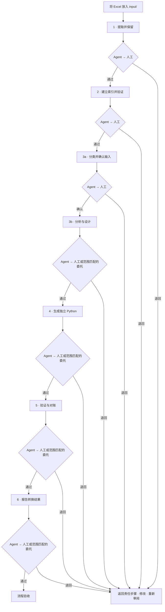

# excel_to_act

[English](README.md) | 简体中文

通过六个步骤将 Excel 工作簿转换为来源绑定、可审阅的 Python 流程。每一步都生成机器可读的 JSON 证据和面向人的交接报告。Agent 从当前步骤的工具目录选择工具、检查证据，并先审阅确切的交接报告，再由用户审阅。只有明确且当前有效、范围匹配的委托才能在允许的后续步骤替代人工审阅；输入边界始终需要人工确认。

## 流程



将工作簿放入 `input/`，每个来源和运行都使用 `output/` 下的新目录。`workflow status --workflow DIR` 显示当前证据和允许进入的下一步。创建草稿或工具检查成功本身不会批准或推进流程。证据变更会使相关决定失效；退回记录保留在流程台账中。

## CLI 与交付物

运行 `excel-to-act stepN tools`、`excel-to-act stepN agent` 或 `--help`，查看当前命令、限制和说明。

| 步骤 | 主要命令 | 主要交付物 |
| --- | --- | --- |
| 1 · 提取 | `step1 convert`、`check`、`finalize`、`report` | 保留的源文件部件、清单、`import_checkpoint.json/.md` |
| 2 · 索引与读取 | `step2 index`、`validate`、`prepare`、`query`、`trace`、`report` | 索引、来源绑定的读取包、有界证据包与轨迹 |
| 3 · 分析与设计 | `step3 prepare`、`fields`、`dependencies`、`input-catalog`、`query`、`trace`、`source-trace`、`profile`、`plan`、`check`、`report` | 已确认输入、目标、源候选、变量、方程、模块及 `analysis_design.json/.md` |
| 4 · 生成 | `step4 capture-external`、`discover`、`plan`、`generate` | 独立运行包、源映射、单独的输入/元数据记录、生成报告 |
| 5 · 验证 | `step5 validate`、`oracle`、`reconcile` | 隔离执行证据、原生 Excel 捕获、数值对比报告 |
| 6 · 报告 | `step6 report`、`skill`、`template` | 面向人的转换报告和 JSON 证据 |
| 流程 | `workflow status`、`confirm`、`reject`、`delegate`、`typesafe` | 当前状态和绑定哈希的决定 |

Step 3 从声明的结果倒推，并确认标量、向量、表格、原始输入和公式派生输入边界。Step 4 只为受支持且绑定清楚的设计生成代码。请检查当前工具目录和来源适配器所支持的公式与输入形状；本流程不是通用 Excel 编译器。公式缓存不是模型输入，提取阶段不会运行 VBA。Step 4 冒烟证据只证明运行包可执行。原生 Excel 对比需要 Windows 和 Microsoft Excel。已测试场景不代表所有参数组合覆盖、精算认证、反馈求解或 GPU 支持。

主要交接报告先说明待审阅决定、用途和范围、已验证结果、限制、未决问题、JSON/Markdown 证据链接以及下一步审阅操作。详细来源信息与历史留在证据附录中。缺失事实标为未知或“未记录”，不能写成零。`workflow.json` 是当前验收台账。

## 使用

需要 Python 3.11+。使用 VBA 检查工具时，请安装可选的 `vba` 扩展。

```powershell
python -m pip install -e ".[vba]"
excel-to-act step1 tools
excel-to-act step1 agent
excel-to-act workflow status --workflow WORKFLOW_DIR
$BUNDLE = "output/WORKFLOW/stage4/bundles/revision-NNNN/bundle"
python "$BUNDLE/model.py" --out "output/result.json"
```

参见[六步工作流](docs/workflow.md)、[CLI 指南](docs/cli.md)、[通用 Agent 约定](docs/design/generic_agent_contracts.md)、[结果驱动分析指南](docs/design/result_driven_analysis.md)和[报告约定](docs/design/model_conversion_report.md)。`input/` 和 `output/` 下的源工作簿及运行证据属于本地数据。根目录 README 中英文版本为双语；其他作者编写的项目文档为英语。
