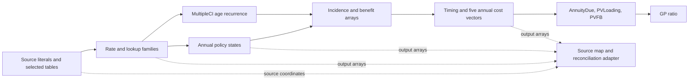

# GP modular redesign proposal

Status: architecture draft for a replacement Step 3 submission. No replacement Step 4 generation is approved by this document.

Source: `input/Pricing.xlsm`, SHA-256 `dc1de98b5e27fa85e233e7ccfa56bc21f571b2bb1686ab13b86a43a9cdfe7c7c`. The accepted scope remains the saved GP scenario only: issue age 0, male, benefit term 30, premium pay period 10, sum assured 1000, pricing rate 0.035, and CI decrement enabled.

Evidence anchors: the static candidate-family profile is `output/gp_modular_redesign_20261008/source_family_profile.md`; fresh active closure is `output/stage36_20261008/stage4/discovery/revision-0001/active_trace.json`. The source-bound recurrence packets are `output/gp_modular_redesign_20261008/evidence/state_recurrences/query.md`, `timing/query.md`, and `markov_recurrence/query.md`. The static profile is a grouping aid; the fresh trace is the target-scope authority.

## Decision

Replace the production default of one generated Python function per formula cell with a source-bound model organized around formula families, named arrays, and ordered recurrence loops. The code should show how rates feed policy states, how states feed annual costs, and how those costs reduce to GP. Keep the fixed workbook source equations exactly, including their unusual references.

The rejected Step 4 output did reproduce the saved values, but its roughly 22,910 cell functions and 19.5 MB model file exposed addresses rather than calculation logic. The fresh active trace reached 34,296 cells and recorded 23,098 formula cells. These counts describe spreadsheet expansion; they do not define the number of useful model functions.

A separate static profile groups the 22,910 ordinary formula addresses from the previous source-bound saved-GP active trace into 263 row-normalized syntactic candidates. Those counts describe traced formula addresses, and identical translated syntax does not prove a semantic family. The new Step 4 active trace must establish the target-directed closure for this source.

The reference result remains `AnnuityDue = 8.574676381865864`, `PVLoading = 3.161998467798486`, `PVFB = 14.767563151498457`, and `GP = 2.7283284514524744`. They are validation results, never generated inputs.

## Model variables, not formula cells

The design unit is a logical variable, not a formula cell. A single source cell with no logical axis is a scalar variable. An actuarial projection down rows is one variable indexed by logical time, even when its source column has a seed, a first-row exception, and a later recurrence segment. The generated model API must not expose one variable or function per Excel cell. Cell coordinates belong only in the evidence and reconciliation adapter.

The physical row/column is a candidate axis, not its meaning. The Step 3 plan must cite the formula/header/value evidence that assigns each variable an axis:

- **Policy time:** `Premium!B10:B115` are raw literal policy-year keys, not calculated formulas (`B10=1`, `B11=2`). The source formulas `C10=IssueAge+B10-1` and `D10=PolHolderAge+B10-1` show how the row key selects insured and owner ages. `Premium!H10:H115`, `I10:I115`, and `J10:J115` are 106-value policy-year projections. A Python array index of `0` maps to `Premium` row 10 / policy year 1; index `i` maps to row `10+i` / policy year `i+1`. The physical row is not itself the axis definition.
- **Attained age and category:** in `CI_MaleChoosen`, `C13=0` and `C118=105`; `F13:AC118` formulas use that age column and 24 component headers/cutoffs. Those four `*MaleChoosen` groups are age-by-category tables, not policy-time projections. Index `0` maps to row 13 / age 0. The final bridge `O7:P112` likewise maps index `0` to row 7 / age 0.
- **MultipleCI age/state:** `MultipleCI_Markov!A8=0`, `B9=IssueAge+A8`; with issue age 0, row 9 is age 0 and rows 9–113 are 105 output ages (ending at age 104). The source has 15 labeled CI states in `C:Q`. The GP trace demands 14 of them (`C:P`), with seeds at row8 and state updates only through row112. Age is the sequential axis; state is the second logical axis. Python output-age index `0` maps to row9. Keep full source geometry separate from these demanded slices.
- **Scalars:** `Premium!H1:H3` are three separate scalar reductions and `J1` is scalar GP. They are distinct from the projection variables in `H10:H115` and `J10:J115`, although they share physical columns with them. Their source ranges feed reductions, not a year-by-year variable.

Time variables can have different boundary extents. H/I/J store 106 values for policy years1:106. T includes its year-zero seed `T9=1` and therefore stores 107 values for years0:106; its index0 maps to row9/year0. T9 and T10:T115 remain one variable. Align arrays by their declared year keys rather than assuming every storage index0 represents the same year.

Each variable record has two independent classifications: `role` (`raw` or `derived`) and `kind` (`scalar`, `projection_series`, `lookup_vector`, or `matrix`). It also records `variable_id`, logical `axes`, cited `source_extents`, `demanded_indices` (the target-used part of an extent), `initial_condition`, `equation_segments`, `dependencies` with explicit lags (for example `-1` for prior year/age), `output_usage`, and `error_policy`. A raw scalar and a derived scalar share a shape but have different roles; an age-by-category matrix has different axes from a time projection. Source extents describe the workbook variable; demanded indices constrain this GP calculation. Equation segments express a seed, normal recurrence and exceptional first row inside one variable.

Example contracts:

```text
premium.h_state
  role: derived; kind: projection_series; axes: policy_year=1..106
  source_extents: Premium!H10:H115; demanded_indices: 0..105
  initial_condition: t=1 -> 1
  equation_segments: seed t=1; recurrence t=2..106
  dependencies: H/K/L/O/P/J/M at lag -1
  output_usage: annual state/decrement and mapped cost formulas
  error_policy: source IFERROR fallback 0

premium.policy_year_key
  role: raw; kind: projection_series; axes: policy_year=1..106
  source_extents: Premium!B10:B115; demanded_indices: 0..105
  initial_condition: literal source values; not a calculated recurrence
  output_usage: time powers, benefit-term comparison, and source row mapping
  error_policy: preserve raw values as loaded

premium.gp
  role: derived; kind: scalar; axes: []
  source_extents: Premium!J1; equation: PVFB / (AnnuityDue - PVLoading)
  output_usage: requested target T_GP
  error_policy: source division/error behavior; no inferred unit
```

The `I` variable has its own recurrence segment. At t=2, the source uses `H[t-1]` in the additive term while using `I[t-1]` in the multiplicative term; it must not be normalized to a self-recurrence. This variable-level representation keeps that source quirk visible while still treating `I10:I115` as one projection. Apply the same range-aware partition to `Premium!H1:H3` versus `H10:H115`; a physical column is not a variable identity.

## Proposed generated package

Keep the runtime small and standalone. Separate source data, pricing equations, and Excel-coordinate diagnostics:

```text
gp_model/
  inputs.json       # source literals, selected tables, bindings, source hash
  rates.py          # selected rate tables, CI bridges, MultipleCI recurrence
  premium.py        # annual states, incidence, benefits, timing, costs, GP
  run.py            # small command-line entry point
  source_map.json   # variable axes and index/value to source-cell mapping
```

`inputs.json` contains raw values needed to run the approved scenario: named selectors, table headers, literal table cells, blanks, and error-valued cells, with the original workbook hash. It must not contain cached formula results. Formulas reached from the target, including formula-derived `Qtable`, CI, bridge, and Premium values, are implemented in code. The package should run without the workbook or the `excel_to_act` project installed.

The pricing modules use names such as `policy_year`, `insured_age`, `owner_age`, `ci_rates_by_age`, `h_state`, `i_state`, `death_cost`, and `pv_loading`. Use source headers where they are clear. Keep `H`, `I`, and other unconfirmed states under neutral source-based names rather than assigning them actuarial meanings. The `source_map.json` records each variable's source ranges and maps logical axis values and indices to source coordinates; pricing functions do not use Excel coordinates as variable names.

The data boundary must keep source facts separate from derived values and retain their dimensions:

| Kind | Current saved-scenario shape | Examples |
| --- | --- | --- |
| Raw scalar inputs and selectors | Scalars | Seven named pricing inputs, owner age, selected sex/table headers, payment and benefit indicators, and source hash. |
| Raw source data | Scalars, 1D vectors, and 2D literal tables | Named scenario inputs, `Premium!B10:B115` policy-year keys, table headers, rates and factors, with blanks and cell errors preserved. Formula outputs are excluded. |
| Calculated scalars | Scalars | `AnnuityDue`, `PVLoading`, `PVFB`, and `GP`. |
| Calculated 1D arrays | Per-variable boundary-aware shapes and demanded slices | Derived age/flag projections, four selected CI bridge vectors (106), H/I/J policy-state vectors (106 each), T timing vector (107 including year0), U/V timing vectors (106 each), five cost vectors (106), and MultipleCI age outputs (105). Premium `K/L/O/P/Q` projections have 106 demanded values through row115; `M/N` have 105 demanded values through row114, though their source formula extents continue through row115. |
| Calculated 2D arrays | Logical axis pairs, not assumed to be policy time | Four selected CI component matrices (age x 24 categories, 106x24); MultipleCI source state grid has 105x15 formula cells, but this target demands 104x14 updates plus the 14-state seed and Health vector; death (policy year x 10), CI (policy year x 5), waiver (policy year x 6), survival (policy year x 3), and medical (policy year x 2) incidence/benefit arrays. |

Independent age-table rows and category calculations can be grouped as array operations. MultipleCI and policy-state recurrences must keep time order. Compute each state's update from an unchanged prior-state snapshot before replacing the current state; updating H in place before calculating I would change I's source prior-H reference. The same rule applies to the MultipleCI state group.

The separation follows small, inspectable actuarial implementations: formula families indexed by time and arrays across independent cases, input tables separated from cashflow calculation, and discounting kept explicit. See [lifelib's BasicTerm_M projection](https://lifelib.io/_modules/basiclife/BasicTerm_M/Projection.html), [restless-miles cashflows and discounting](https://github.com/restless-miles/life-insurance-premium-calculator/blob/24742ae7766467f8ef930b5ae6f556d579ca0de9/cashflows.py), and [actuarialmath premium methods](https://github.com/terence-lim/actuarialmath/blob/7d18f11ad304898f177b7922b3c53f70e4c2b4f4/src/actuarialmath/premiums.py). These are design references, not dependencies or actuarial authority for this workbook.

## Module boundaries and calculation order



`rates.py` should expose source-specific family functions, not a generic Excel formula interpreter:

```python
def calculate_rate_tables(inputs) -> RateTables: ...
def calculate_multiple_ci(inputs, rate_tables) -> MultipleCIRates: ...
```

`premium.py` owns the policy-year calculation and scalar root:

```python
def project_premium(inputs, rate_tables, multiple_ci) -> PricingResult: ...
def calculate_gp(annuity_due, pv_loading, pvfb) -> float: ...
```

The return object should expose the three root intermediates, 106-row state/cost arrays, the 107-value T vector, 106-value U/V vectors, and demanded incidence/benefit arrays used for reconciliation. Functions fill arrays by their declared time/category keys; no function is emitted for an individual cell.

## Required equation families

The new Step 3 plan must give every target-active formula family its source range, representative source formula, output shape, inputs, dependencies, index meaning, boundary behavior, and formula-local error policy. The following family map is the minimum architecture; formula coefficients and source lookups must be copied from the bound workbook, not inferred from labels. Record each variable's full formula extent separately from its own demanded indices. In this trace `Premium!G`, `R`, `S`, and `CB` have no active cells; exclude them as optional diagnostics. The trace demands `F` and `CC:CD` only in their first ten rows. It demands `K/L/O/P/Q` through row 115 and `M/N` only through row 114. A source-wide formula inventory must not silently expand this target into a whole-workbook rebuild.

| Family | Source / shape | Execution and contract |
| --- | --- | --- |
| Policy-year key and axes | Raw `Premium!B10:B115`; derived `C:F` formulas | Keep `B10:B115` as a raw 106-value policy-year vector. Derive each calculated projection from its source formula and selectors; evidence maps year key to age/benefit/premium flags. `F` is demanded only for rows 10:19. These row-wise values are independent after inputs are bound. |
| Rate-table lookup families | reached `Qtable`, `CI_Male`, `AMR_Table`, and `Benefit_Table` formulas and their literal source tables | Resolve the exact named header and sex selected by this scenario. Preserve `MATCH(...,0)`, `VLOOKUP(...,FALSE)`, approximate `VLOOKUP(...,TRUE)`, blank results, and the source's `IFNA` fallbacks. Do not load formula caches as ready-made rates. |
| Selected CI component rates | Four selected male `*MaleChoosen!F13:AC118` matrices (age x 24 categories, 106 x 24) and row totals | These are age/category tables, not policy-year vectors. Rows are independent after source tables and selected weights are resolved. A component keeps the source cutoff rule (`To age=0` means unrestricted; otherwise include only the source age test) and each row total sums its 24 components. The source `CI_Male` lookup families and the selected formulas are calculated, not copied from cached values. |
| Final CI age bridges | `CalculationOfBE_CI`, `CalculationOfBE_MinorCI`, `CalculationOfBE_ModerateCI`, `CalculationOfBE_SpecialCI`, `O7:P112` | Four 106-value age-indexed vectors. Preserve the exact age-key lookup and selected male return column. These bridges are prerequisites to annual policy calculations. |
| MultipleCI coefficient variables | `J1:J4` (4 ratio aliases), `U3:U6` (4 payment weights), `C6:P6` (14 state multipliers) | These are **derived lookup vectors**, not raw coefficients or time projections. J[k] resolves source `RatioCI[k]`. U[k] evaluates the exact `IF(J[k]=0,0,1)` over source payment labels T3:T6. C6:F6 resolve CIqx1, G6:L6 resolve CIqx2, and M6:P6 resolve CIqx3 over the state labels C7:P7. These calculated variables have no prior-time lag and must precede the age/state loop. Preserve the aliases, comparison and error behavior; never load their cached outputs into inputs.json. |
| MultipleCI state recurrence | Demanded `B9:B113`, `C8:P112`, `S8:S112`, `T9:T113`, `W9:W112`, `X9:X113`, plus selected coefficient cells | Produce 105 age outputs in order. Initialize the 14 demanded states `C8:P8=0` and Health `S8=1`. For rows9:112 derive W/X and update the 14 states and Health from prior-age values. T at rows9:113 uses the prior state/Health row and current X; row113 does not require another state update or W113. Q (the terminal CI1234 state), Death R, and diagnostic U/V/Y age columns are outside this GP trace; U3:U6 coefficient cells remain required. Retain `IF(B>=106,1,...)` on T; it is inactive for saved ages0:104. Source O9 contains `H8*RatioCI3 + I8*RatioCI3 + L8*RatioCI1` before its outflow term. Preserve those exact terms under the O state variable instead of guessing a generic subset-transition rule. |
| Premium states and decrements | `Premium!H10:J115` (three 106-value state variables); `K/L/M/N/O/P/Q10:115` are separate projection variables | Initialize `H10=I10=J10=1`, with source seed `Q9=1`. Update `H/I/J` through row 115 from prior-row states and decrements. Demand `K/L/O/P/Q` for rows 10:115 (106 values each); demand `M/N` only for rows 10:114 (105 values each), although their formula extents continue through row 115. Calculate each variable only at its demanded indices. Keep each source `IFERROR` fallback exactly. `I11` uses `H10` as its additive starting value while multiplying the previous `I10`; preserve that prior-H reference for every later row. `G`, literal `R`, and their associated calculations are not in the fresh GP active trace and are optional excluded diagnostics, not model requirements. |
| Timing and discount vectors | One T variable at `Premium!T9:T115`, shape107 / years0:106; separate U/V variables at `U10:U115` and `V10:V115`, shape106 / years1:106 | T's initial segment is `T_0=1`; its years1:106 segment is `T_t=(Q_t+P_t)/(1+i)^B_t`. Preserve `U_t=J_t/(1+i)^(B_t-0.5)` and `V_t=J_t/(1+i)^(B_t-1)`. Align their year keys explicitly for costs and root slices. `Premium!S` is absent from the fresh GP active trace and remains an optional excluded diagnostic. |
| Incidence and benefit arrays | `Premium!Y10:BU115`: death 106x10, CI 106x5, waiver 106x6, survival 106x3, medical 106x2 | Preserve the selected age, sex, benefit, and timing branches. Each row/category is independent after rates and states exist. Retain incidence operands when the selected benefit is zero; a zero product does not excuse skipping an active source formula or its error behavior. |
| Annual cost vectors | `Premium!BV10:BZ115` and `CA10:CA115`; five vectors of length 106 | For row `t`, `BV=SUMPRODUCT(Y:AH,AV:BE)*U`; `BW=U*(AI*BF+AL*BI+AM*BJ)+(AJ*BG)*H/(1+i)^(t-0.5)+(AK*BH)*I*I/(1+i)^(t-0.5)`; `BX=SUMPRODUCT(BK:BP,AN:AS)*T`; `BY=BQ*(PaymentTime="EOP" ? T : V)+BR*V+BS*T`; `BZ=U*(BT*AT+AU*BU)`; `CA=SUM(BV:BZ)`. Keep the source `I*I` term and formula-specific blank/error results. `BY10` is the first equation segment and has no `IFERROR`; `BY11:BY115` is the later segment wrapped in `IFERROR(...,"")`. They remain one `survival_cost` projection variable with a first-row exception. |
| Root reductions | `Premium!H1:H3`, `J1`; loading inputs `CC10:CD19` | These are four scalar variables, separate from H/J projection variables. Source `H1` sums `T9:OFFSET(T9,PremPayPeriod-1,0)` and `H2` sums `CD10:OFFSET(CD10,PremPayPeriod-1,0)`; for this saved case these resolve to `T9:T18` and `CD10:CD19`. `H3=SUM(CA10:CA115)` and `J1=PVFB/(AnnuityDue-PVLoading)`. `CD_t=CC_t*T_(t-1)`. Only the first ten loading rows are demanded. Keep `CC`'s payment-term column match exact and its `LoadingTable` row lookup approximate. `Premium!CB` is absent from the fresh GP active trace and remains an optional excluded diagnostic. Do not assign GP units beyond the pending business confirmation. |

For the annual loop, year `t=1` is the source seed row 10. `H`, `I`, and `J` are three separate projection variables, each represented as one 106-value vector with a seed segment at `t=1` and a recurrence segment at `t=2..106`. For `t=2..106`, preserve these row equations:

```text
H[t] = IFERROR(MAX(H[t-1] + (-K[t-1]-L[t-1]+O[t-1]-P[t-1])/J[t-1]*H[t-1] - M[t-1], 0), 0)
I[t] = IFERROR(MAX(H[t-1] + (-K[t-1]-L[t-1]+O[t-1]-P[t-1])/J[t-1]*I[t-1] - N[t-1], 0), 0)
J[t] = Q[t-1]
```

For years `t=1..105`, compute `K[t]:Q[t]` from current-year age, selected rates, current states, and source selectors; those values feed year `t+1`. At `t=106`, compute the demanded `K/L/O/P/Q` values as well, but omit `M/N`, whose row-115 values are not demanded. This ordering matters: the prior-row decrements break the apparent same-row dependency. The `I` equation's additive `H[t-1]` term is an explicit source exception, not a normalized self-recurrence. The `MultipleCI_Markov` age rows and annual policy states are sequential because each row consumes prior state. Calculate cost rows only after the required states and rate arrays are ready. Do not claim that an array makes a recurrence parallel.

## Fidelity rules and unresolved scope

- Bind the generated package and source map to the exact source hash. Recompute formulas from source text and literal values; do not treat saved formula caches or old Step 4 results as inputs.
- Preserve source lookup, blank, error, and branch behavior at the formula that owns it. A source `IFERROR` fallback is not permission to hide a generator's unsupported formula. Unsupported active source logic must block generation. The fresh active trace reports no reached source-error cells; the broader source-error audit records 150 handled and zero unhandled errors, so error behavior still needs explicit family coverage.
- Preserve selected zero-benefit operands and the saved scenario's actual choices. The current path assessment found Level100/None columns do not select the GP-dependent return columns. If another scenario activates the GP feedback cycle, stop and require a new design; no feedback solver is in this scope.
- This design does not claim support for other saved configurations, untested branch values, ages beyond this scenario, business validation of actuarial assumptions or GP units, alternate backends, or GPU execution. A separate Step 3 is required for those cases.
- The generated model is bound to this workbook hash and saved scenario. Reuse for a new workbook is not implied: it needs its own source identity, axis evidence, family fingerprints, Step 3 design, and fresh Step 4 trace. A matching source-family template may be reused only after those checks pass; there is no automatic cross-workbook compiler.
- The source cells do not establish business meanings for all state variables. Keep source identifiers or workbook labels in code until a reviewer confirms any richer names.

## Workflow and CLI gate

The Step 4 rejection requires a new Step 3 submission. The old Step 3 revision and rejected Step 4 bundle remain unaccepted reference evidence; neither approval transfers to a replacement model. Create and human-confirm the new design, then bind Step 4 to that exact design revision and source hash.

| Status | Proposed command | Artifact and gate |
| --- | --- | --- |
| Available now | `step3 plan`, `step3 check`, `workflow confirm`, `step4 discover`, `step4 generate` | Existing design/report and current workflow hashes. These do not yet create or require this variable-level semantic plan. |
| Proposed; unavailable now | `step3 plan --analysis ANALYSIS_DIR --semantic-design VARIABLE_MODULE_INPUT_JSON --out SEMANTIC_DIR` | Consumes the Agent's source-cited variable/module draft; writes `semantic_plan.json` and `semantic_plan.md`. Records variable contracts, logical axes, seeds, recurrence/equation segments, lagged dependencies, usage, errors, and candidate family fingerprints. `step3 report` subsequently binds these artifacts in `analysis_design.json` and `analysis_design.md`. This is a static source-design artifact, not a Python model. |
| Proposed; unavailable now | `step3 check --analysis ANALYSIS_DIR --semantic-plan PLAN_JSON` | Writes `semantic_check.json` and `semantic_check.md`. Checks that each required candidate formula family has an explicit variable/equation mapping, its source evidence and hash are current, and every projection has axes, a seed or explicit no-seed rule, equation segments, dependencies/lag, output usage, and error behavior. Reports mapped, excluded-with-reason, and unexplained members separately. This is candidate-family completeness only; it cannot establish the fresh target-active closure for a new source. |
| Proposed behavior; command already exists | `step4 generate --workflow WORKFLOW_DIR` | Reads the semantic plan bound to the approved Step 3 report and requires the fresh Step 4 discovery trace to contain no unmapped active family. If discovery expands the candidate set, generation blocks and Step 3 must be revised and reconfirmed. Generates logical variables/arrays and family functions, with no per-cell fallback. No second plan path may bypass the accepted artifact. |

The Step 3 human confirmation must bind the source hash and hashes of `analysis_design.json`, `analysis_design.md`, `semantic_plan.json`, and `semantic_plan.md`. Any edit invalidates that approval. Step 4 discovery remains the authority for fresh active dependency closure; the static Step 3 check does not claim to prove it. Keep the coordinate adapter for Step 5 citations and cell-by-cell reconciliation outside the pricing functions.

The existing Step 4 active discovery, Step 5 fresh Excel oracle/validation/reconciliation, and Step 6 command names can remain. Their bundle/result contracts need to accept the compact package and source map. Step 5 must compare the same GP roots and all demanded mapped states, timing vectors, rate bridges, incidence/benefit arrays, and cost vectors. Request the additional bridge and Markov ranges through the existing finite-range oracle interface; the current Premium-only baseline does not verify those additional arrays. Keep first/last periods, lookup modes, blank/error outcomes, the prior-H reference, and the I-squared term in the comparison plan. Acceptance includes a standalone run, current-source/hash verification, exact source-error outcomes, and readable code whose function count follows equation families rather than formula-cell count. No fixed file-size target is needed.

## Step 3 substeps and submissions

| Substep | Tool / current status | Machine-readable submission | Human-readable submission |
| --- | --- | --- | --- |
| 3.1 Define target and saved scenario | Existing `query`, `trace`; Agent records scope | Target/scenario and eight known path records | GP equation, branch explanations, exclusions and options |
| 3.2 Identify variables and axes | Existing `fields` plus source `query`; variable-level grouping is proposed | Variable catalog: scalars, projections, age vectors and matrices | Variable table, source extents, axes and seed/recurrence examples |
| 3.3 Summarize equation families | Current static evidence helper is a prototype; semantic `plan` extension is proposed | Family fingerprints, source membership and exceptional segments | Family equations, initialization, lags and error policies |
| 3.4 Assign modules and order | Proposed semantic `plan` extension | Module DAG, interfaces, equation-to-variable/module mapping | Module flowchart and ordered calculation explanation |
| 3.5 Check and compare implementation options | Existing static `check`; semantic coverage extension is proposed | Coverage ledger and semantic-check blockers | Fixed/staged/general options and missing information |
| 3.6 Submit design | Existing `report`, `workflow confirm` | Hash-bound `analysis_design.json` and supporting evidence | `analysis_design.md` and this proposal; separate Agent and human decisions |

The current draft submits a source formula profile and a Premium variable catalog. It has not completed the reviewed equation-to-module map for every candidate or array follower. The 263 syntactic candidates are not 263 approved semantic families, and the 77 Premium projection candidates are not a full workbook variable catalog. Neither count is a percentage of all configurations.

The [coefficient evidence packet](../../output/gp_modular_redesign_20261008/evidence/markov_coefficients/query.md) records the exact derived MultipleCI aliases and weight formulas with source IDs. The Step 3 JSON includes their role/kind/axis contracts separately from raw named inputs.

The recommended option is the complete saved GP target implemented through these compact modules. A staged option can first deliver the two denominator routes (2/7 numerical routes), then add death and CI costs (4/7), then waiver, survival and medical (7/7). GP is complete only at the last stage; zero selected benefits do not justify skipping their active operands. Assess the inactive feedback condition separately (1/1 condition) throughout. General configuration support has unknown coverage until its input domains and branches are specified.

## Information sufficiency and remaining work

The bound source facts, prior target-directed trace, and numerical reference are sufficient to draft a fixed-scenario modular model. The current evidence identifies the main variables, axes, rate prerequisites, recurrence loops, component costs and final root equation. The existing numerical prototype remains a diagnostic comparison aid; the independent fresh Excel baseline remains the acceptance reference.

After the user adjusts this proposal, extend the static Step 3 plan/check tools and complete the source-to-variable/equation/module map, array-follower shapes, exact lookup/blank/error policies, and exceptional segments. Submit the checked semantic plan with the full Step 3 report for Agent and human approval. Only then implement and run the compact Step 4 generation, followed by its own reviews and Step 5 reconciliation. This separates design feedback from formal release of pricing-code generation. Units and richer actuarial names need human confirmation only if acceptance extends beyond faithful source reproduction. Additional parameter domains, active feedback and GPU batching remain separate design work.

Python is the first implementation backend. Named axes and pure formula-family functions make later batch execution easier to assess. Time/age recurrence remains sequential; independent policy/scenario batches and category operations are the candidate parallel dimensions. No Julia/C++ rewrite, GPU dependency, or performance claim is needed for this single saved scenario.

## Later implementation tier

Implementation is **complex** and should stay with one persistent `gpt-6-sol / high` worker after design approval. Evidence is the interaction of four rate/CI bridge families, 105 MultipleCI age outputs with 14 demanded state recurrences, a 106-year policy recurrence, multiple lookup modes, and five year-by-category cost families with source-specific first-row behavior. The equations and outer module boundaries are now identifiable, so this does not need the extreme tier. The worker should use the approved variable map and the fresh trace as its contract; no implementation or worker handoff is authorized by this architecture draft.
