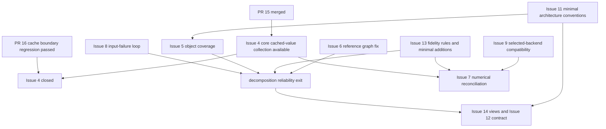

# Current-Branch Issue Review and Implementation Plan

This plan reviews all 12 GitHub Issues in `ferryhe/excel_to_act` and uses the current branch to decide which to keep, close, merge, or rewrite. It recommends removing already-implemented work from the backlog first, then completing input-failure handling, coverage accounting, and fidelity collection, followed by a reliable reference graph, minimal Agent views, and numerical reconciliation.

Independent review is complete: five items of feedback were assessed and addressed, and the conclusions were applied to the titles, bodies, labels, and statuses of all 12 GitHub Issues. The #4 cached-value boundary regression was then added, passed independent code review and CI, and was merged by PR #16, which closed #4. Final remote readback passed for every item: 9 open and 3 closed; #4 is complete, #10 is not planned for now, and #12's requirements were merged into #14. The Epic, #7 dependencies, README, and local backlog have been synchronized; implementation should proceed according to the acceptance criteria and phase plan below.

## Review Basis and Current Status

- Review date: October 3, 2026.
- Review branch: `feat/step1-coverage-handoff`, with review HEAD `c86fa5585b7a8ca0d27642f9f958379d25c120fb`. Compared with the initial draft at `41fce35`, a new commit fixed the row/column input orientation for Data Tables, expanded the corresponding tests, and aligned the handoff language description with English; these changes did not alter any per-item scope judgment. The branch was retained, and the working directory was switched back to main after delivery.
- At review time, main was `b7270f5810c221bcca64e9fb0acd8f1a7678f2d1`, with file contents exactly matching the review HEAD. After #4 delivery, main and `origin/main` were both `f12871b02c73b065f941931e169ad618c73ee8a6`; compared with the reviewed content, only cached-value boundary tests and corresponding fixture adjustments were added.
- [PR 15](https://github.com/ferryhe/excel_to_act/pull/15) was merged into main on 2026-10-03 at 13:15:43 UTC, with head `c86fa55` and merge commit `b7270f5`. CI passed on Python 3.11, 3.12, and 3.13; passing existing checks does not mean that every Issue's acceptance criteria are satisfied.
- Before the review, GitHub's all-status Issue list contained only #3–#14; all 12 were OPEN and had no labels, milestones, or assignees. All bodies and comments were read; at that time, only #3 had a comment filling in an Issue number. There are still 12 Issues in the final state: 9 open, #4 closed as `completed`, and #10/#12 closed as `not_planned`; existing feature, bug, or documentation labels were added as appropriate, with `duplicate` also added to #12. Assignees and milestones did not change.
- The four entries originally labeled #15–#18 in `docs/issues/backlog.md` had no corresponding real GitHub Issues. They were renamed with local task identifiers and now reference PR 15; the corresponding fake Issue numbers in the README were also corrected. GitHub #15 and #16 are now the core-delivery and cached-value boundary-regression PRs, respectively.
- Review HEAD verification: 25 passed, Ruff passed; the tests were run by adding `src` to the import path. The import error on the first direct pytest run was a local environment issue, not a project defect. Later, [PR #16](https://github.com/ferryhe/excel_to_act/pull/16) was merged on 2026-10-03 at 15:08:52 UTC (`f12871b`): all 5 cached-value tests, the full 26-test suite, Ruff, compileall, and the installed CLI help check passed; CI passed on Python 3.11, 3.12, and 3.13. The final merge tree matches the commit tree that passed independent review.
- Five planned design documents and `src/excel_to_act/validation/` do not exist. `completeness.json`, `handoff.json`, and `handoff.md` already exist, so they should not be planned again as new modules to build from scratch.

The original Issue snapshot is in [issue_snapshot.json](../../graphify-out/issue_snapshot.json); the reproduction script and results are [audit_probes.py](../../graphify-out/audit_probes.py) and [audit_probe_results.json](../../graphify-out/audit_probe_results.json). Reproductions used only temporary workbooks.

The complete updated snapshot is [issues_after_update.json](../../graphify-out/issues_after_update.json); per-item verification of titles, bodies, labels, statuses, and closure reasons is in [issue_publication_verification.json](../../graphify-out/issue_publication_verification.json). All 12 items match.

## Independent Review Feedback and Assessment

An independent reviewer used `gpt-6-sol / high`. The first review identified five plan issues requiring corrections; I assessed and revised each one, then the same reviewer checked only those five items and returned PASS for all. The full report, including the initial review and follow-up check, is in [issue_plan_review.md](../../graphify-out/issue_plan_review.md).

| Feedback | Assessment and update |
|---|---|
| F1 Stale baseline and test count | Accepted; updated to `c86fa55`, 25 passing tests, and separately recorded CI for all three Python versions. |
| F2 README still had fake Issue numbers | Accepted; README and backlog now use local task identifiers and PR #15 consistently. |
| F3 Cached-value boundary lacked an automatic regression | Accepted as a requirement before closing #4; 0, False, and empty-string values all worked in temporary samples, so this was not classified as an existing implementation defect. PR #16 delivered the automatic regression; independent review and all CI checks passed, and #4 is closed. |
| F4 License CI gate was unclear | Accepted; #9 specifies the default runtime dependency closure, GPL/AGPL/EUPL set, CI failure condition, and acceptance check with a known violating sample. |
| F5 #13 documentation and code scope were undecided | Accepted; #13 now explicitly includes rules, minimal collection of raw fields, Schema, readback, and regression acceptance; #7/#14 depend on the actual fields. |

## Disposition of All Issues

Priority definitions: P0 blocks reliable use of the current decomposition artifacts; P1 supports the next phase of work; P2 waits for a clear use case. Priorities have been added to each Issue body.

| Issue | Actual state on current branch | Updated task definition | Priority |
|---|---|---|---|
| [3 Phase 1.5 Epic](https://github.com/ferryhe/excel_to_act/issues/3) | Child items exist, but their bodies, statuses, and local numbers have drifted | Keep as an overview; rewrite around actual tasks, dependencies, and phase exit criteria | Management item |
| [4 cached value](https://github.com/ferryhe/excel_to_act/issues/4) | Core capability and cached-value boundary regression are both merged; five dedicated tests passed | Accepted and closed; body records PR #15/#16, independent review, and CI evidence | Complete |
| [5 coverage invariant](https://github.com/ferryhe/excel_to_act/issues/5) | Independent checks exist, but original coverage is still an identity and counting units differ | Keep and rewrite around object definitions, independent discovery, and a failed-artifact workflow | P0 |
| [6 formula reference parsing](https://github.com/ferryhe/excel_to_act/issues/6) | Still uses regex; incorrect edges and missed parses have been reproduced | Keep; switch to tokenizer plus minimal reference parsing; reuse existing name type | P0 |
| [7 numerical oracle](https://github.com/ferryhe/excel_to_act/issues/7) | Cached-value collection exists; numerical reconciliation and report are unimplemented | Keep and reduce first release scope; add one recalculation backend to cached baseline, defer others | P1 |
| [8 input robustness](https://github.com/ferryhe/excel_to_act/issues/8) | Corrupt xlsx and three unsupported formats still raise exceptions in the CLI path | Keep; extend the fix across the complete reader, orchestrator, and CLI failure path | P0 |
| [9 extras and dependency checks](https://github.com/ferryhe/excel_to_act/issues/9) | Extras have been split and core CI covers three versions; remaining acceptance is incomplete | Keep, remove completed split work, and add only core dependency checks and compatibility for the selected oracle | P1 |
| [10 Docling research](https://github.com/ferryhe/excel_to_act/issues/10) | Dedicated report not written; project already uses openpyxl plus OOXML | Closed as not planned for now; briefly include existing tool-selection rationale in #11 | P2, reopen as needed later |
| [11 layers and contracts](https://github.com/ferryhe/excel_to_act/issues/11) | Existing pipeline but no normative layer definitions | Keep as a short architecture alignment; distinguish processing layers from cross-layer services, with no directory moves required | P1, essential conventions first |
| [12 Agent reading contract](https://github.com/ferryhe/excel_to_act/issues/12) | No documentation or validation implementation; depends on view_id that #14 has not defined yet | All requirements merged into #14; #12 closed and marked duplicate | With #14 |
| [13 number and formula fidelity](https://github.com/ferryhe/excel_to_act/issues/13) | number_format and cached-value fields exist; raw values and date serials are still not preserved | Explicitly redefine as rules plus minimal field-collection additions; keep implementation acceptance in the same Issue | P0 |
| [14 L1 view](https://github.com/ferryhe/excel_to_act/issues/14) | No view contract or compiler; documentation task nevertheless required two compiler runs | Merge #12; change to design plus minimal executable view; defer compression research | P1 |

In the final state, #4, #10, and #12 are closed, leaving 9 open Issues: one Epic and eight work items. #4 is complete; #10 is not planned for now, and #14 continues to carry #12's implementation.

## Small-Sample Reproduction Results

| Issue | Actual result | Impact on the plan |
|---|---|---|
| #5 normal fixture | recognized=25, opaque=2, independent discovered=21, but overall status is pass | Do not change coverage_arithmetic from info to error directly; unify counting units first |
| #5 intentional omission | Removing a cell causes fail; removing a conditional-format object and updating the existing count still passes | Cell omission is already checked; object-level omission still needs coverage |
| #6 string | `="A1"` produces the false edge `cell:Inputs!A1` | Handle only reference-class tokens and ignore TEXT |
| #6 Table and name | `=Table1[Col]` is recorded as external + unsupported; `=SUM(MortRate)` is only unsupported | Brackets cannot be treated as equivalent to external links; Table and name information is needed |
| #6 cross-sheet reference | `='O''Brien'!$B$2` is parsed as `Brien!B2` | Add acceptance for legal sheet names with escaped quotes |
| #6 external reference | `=[Book.xlsx]Inputs!A1` produces both an external edge and a false local cell edge | Preserve external workbook identity; do not invent an equivalent local edge |
| #8 CLI | Corrupt xlsx raises BadZipFile; xlsb, xls, and csv raise InvalidFileException; no handoff | Reader's type diagnostic does not stop the orchestrator; exit code 1 alone is insufficient for acceptance |
| #13 date | OOXML stores numeric value 45292, but the artifact stores string `2024-01-01 00:00:00`; data_type changes from n to d | Preserve the raw value and type; a display value cannot replace the factual value |
| #13 numeric text | Numeric text in input XML is converted to float, with no field to hold the original text | Preserve source text and number_format, so parsed float is not treated as the complete original evidence |

No real encrypted workbook was used for reproduction. This review confirmed the corrupt-file and unsupported-format paths; a real encrypted file is still required as an implementation acceptance sample for #8.

## Per-Issue Rewrites and Acceptance Plan

### Issue 3: Project Overview and Phase Exit Criteria

Updated title: `docs: Phase 1.5 Actual Tasks, Dependencies, and Phase Acceptance (Epic)`.

Keep the Epic's indexing role, but remove the outdated acceptance criterion that creating child Issues completes the entire Epic. Use real Issue links in the GitHub body, record statuses such as "not done, partially complete, merged pending acceptance, complete, and not planned for now," and organize work around the phase exit criteria in this plan.

The current priorities put five design documents and tooling research at P0 while the actual CLI failure path is P1; reprioritize according to artifact trustworthiness. Create `adr/` and `experiments/` directories when there is content for them; do not add empty directories just to satisfy a checklist.

Acceptance: Every active child item has a real link, current status, and dependencies; README, local backlog, and GitHub bodies agree; README no longer labels local tasks as issues #15/#16/#17; the four implemented local entries reference PR 15; completing the Epic means reaching this phase's exit criteria, not merely creating child Issues.

### Issue 4: Cached-Value Collection

Core collection was merged with PR #15; the remaining cached-value boundary regression was merged with PR #16, passed one independent Sol/high code review, had no pending remote feedback, and passed CI on all three Python versions; #4 was closed as complete. The delivery branch was deleted and the temporary worktree archived.

Evidence: [cached_values.py](../../src/excel_to_act/ingest/cached_values.py) reads the data_only value side; [extractor.py](../../src/excel_to_act/inventory/extractor.py) merges by sheet and coordinate; [CellInventory](../../src/excel_to_act/schemas/artifacts.py) and the exported JSON Schema contain both cached-value fields; [dedicated tests](../../tests/test_cached_value.py) cover cached values, missing caches, constants, and no duplicate counting.

The original Issue required `openpyxl_reader.py` to support cached values as well, which the current implementation does not do. The local backlog explains the divergence: the manifest does not store cells, so another read has nowhere to be represented. Sync this explanation to GitHub rather than adding a read solely to align filenames.

The acceptance wording was changed from "cached value is non-empty" to "available=True when a cache exists, False when missing." A minimal automatic regression has now been added, covering valid 0, False, empty strings, and missing-cache states; it distinguishes typed-string `<v/>` from untyped `<v/>`, and checks formulas, constants, warnings, and Schema readback. All 5 cached-value tests, the full 26-test suite, Ruff, compileall, and CLI help passed. This delivery completed acceptance without changing the core collection implementation. Reconciliation when some formulas lack cached values belongs to #7; raw cached text and date types belong to #13.

### Issue 5: Independent Object Discovery and Coverage Accounting

Updated title: `fix(coverage): Unify Object Counting and Make Omissions Block Downstream Use`.

Evidence: `extractor.py:184–185` still adds all unsupported-record counts to opaque and then derives discovered from those same two numbers. The independent total in `verify/completeness.py:234` mixes cells, sheets, and unmodeled parts, and does not cover the same set of names, merged ranges, layout objects, and validation objects. Replacing a single variable cannot fix this.

Suggested scope:

- First list counting units, stable identities, and independent XML discovery paths for currently supported objects. Explain logical-object coverage separately from package-part accounting; do not count a part and its recognized internal objects twice.
- Compare sheets, non-empty cells, names, Tables, merged ranges, data validation, conditional formatting, comments, hyperlinks, and currently collected layout objects by category. The new branch's Data Tables, controls, and VBA parts also need explicit accounting rules; VBA semantics do not need to be interpreted.
- Warnings such as `missing_cached_values` with `opaque=False` are not unresolved objects. Multiple diagnostics for the same unresolved object must not be counted more than once.
- Handle a missing part, scan failure, and a true zero-object result separately; match objects by stable identity, not only global counts or by consuming any evidence of the same type.
- Add per-sheet and per-category differences to existing completeness and handoff artifacts, reusing `report/handoff.py`. Do not make creation of `report/markdown.py` a prerequisite for this Issue.
- Diagnostics and handoff must still be written on failure. Pydantic validation on `CoverageSummary` currently rejects unequal counts; during implementation, arrange validation so it does not abort before diagnostics can be saved.

Acceptance: A normal sample closes under unified counting rules; deliberately skipped declared objects such as cells, names, conditional-format objects, and Tables cause failure with their locations identified; missing scan evidence cannot pass; non-opaque warnings do not change coverage; the CLI writes a failed handoff and returns nonzero. Export new fields to JSON Schema and check readback of existing artifacts. Raise a real coverage gap to error only after the counting rules are correct.

Dependency: Only #11's minimal object-responsibility conventions are needed; do not wait for the full architecture document. This item couples OOXML discovery, model validation, and reporting, so finish the object-counting table before implementation.

### Issue 6: Tokenization and Reference Parsing

Updated title: `fix(graph): Use a Tokenizer and Minimal Reference Parsing to Build Reliable Dependency Edges`.

Keep. The current problems have been reproduced and directly affect #14's views. A tokenizer can distinguish TEXT from RANGE, but it does not perform the project's semantic resolution of names, Table columns, and external workbooks; "switch to a tokenizer" is not the complete deliverable.

Suggested scope: Use the current `openpyxl` tokenizer to process tokens; implement minimal parsing for reference-class operands. Reuse existing `GraphNodeKind.name` rather than listing it as a type to add. Prefer expressing structured references with existing range plus metadata, adding a type only if the current contract truly cannot represent them. Resolve names in both workbook and sheet scope; collecting required name and Table-column facts belongs in this actual reference-path fix.

In addition to the original five cases, acceptance should cover escaped quotes in legal sheet names, prevent external references from producing false local edges, and treat formulas without references — `=1+1` and `="A1"` — as valid zero-dependency formulas, not as omissions merely because they have no outgoing edge. Preserve an explicit unresolved record and source_location for references that cannot be statically located; do not add an evaluator or full formula AST.

Dependencies: Clarify name and formula-field conventions first; use the results of #5 and #13 in final integration acceptance. When updating the builder, also check orchestrator, VBA merging, and `formulas_linked`, reusing the existing node namespace.

### Issue 7: Cached Baseline and Numerical Reconciliation

Updated title: `feat(validation): Reconcile the Cached Baseline with One Optional Recalculation Source`.

Keep, but reduce the first-release scope. The repository currently has only read facts and a reference graph, with no in-house formula evaluation results. Therefore, copying cached values and comparing them with the same cache cannot be called independent numerical validation. The workbook's saved cache is the baseline, and the report must also state whether it may be stale or incomplete.

First release deliverables: `ValidationReport`, a coordinate-based comparison function, and one optional recalculation adapter; store the report through the existing store and handoff. Use `validation/` and the existing plugin pattern; the protocol should cover only actual call needs. `CompletenessReport` continues to handle structure, while the numerical report handles results separately; a structural pass does not mean a numerical pass.

First verify installation of the existing `oracle-formulas` extra and its capability on a small sample, then decide on the first backend. If it cannot satisfy the first-release fixture, select LibreOffice and record why. Do not implement all backends in the first release; add a second recalculation backend only if the first has a clear coverage gap. Excel COM remains a local extension only.

Acceptance: The same fixture has at least two distinct sources: a cached baseline and an actual recalculated result; when a difference beyond tolerance is deliberately introduced, the report fails and identifies the sheet, address, actual value, expected value, and tolerance; dates, booleans, error values, and numbers have explicit comparison rules; missing caches or backend must be shown as not run or incomplete, never as verified and passed. Separate the default CI fallback path from a real integration check with the backend installed; the latter must not skip everything.

Dependencies: #4 cached-value fields and boundary acceptance (completed by PR #15/#16), #13 value-type conventions, and #9 compatibility checks for the selected backend. No need to wait for Agent views or Python generation. The original Issue said "three oracles" but actually listed four; correct that along with its body.

### Issue 8: Complete Input-Failure Path

Updated title: `fix(ingest): Save Diagnostics on Read Failure and Let the CLI Exit Cleanly`.

Keep and raise to P0. `scan_ooxml_package()` already returns an error for unsupported extensions, but `Phase1Orchestrator.run()` proceeds to the extractor unconditionally; fixing only the scanner therefore cannot satisfy CLI acceptance.

Fix expected read exceptions in the reader and scanner, and have the orchestrator stop collection when the manifest contains an error. Use existing `UnsupportedFeature`, run metadata, and handoff artifacts to represent failure; define which files are available in this failure case and avoid fabricating a complete inventory. The CLI should provide a readable reason and controlled nonzero exit code. Do not add a generic retry or error framework for this item.

Acceptance must run end to end through the CLI: real encrypted xlsx, non-ZIP/truncated ZIP, damaged or missing required XML in a ZIP, and unsupported xlsb/xls/csv. All must save an error record without uncaught read exceptions, and extractor or later phases must not be called after failure. A real encrypted sample is still needed; ordinary corrupt ZIPs cannot replace all encrypted-workbook acceptance.

Decryption, legacy-format conversion, and binary reading are not part of the first implementation. Tool-integration notes are reduced to a supplemental summary and are not prerequisite research for fixing the current crash path.

### Issue 9: Remaining Dependency Checks

Updated title: `chore(build): Check Core Dependency Boundaries and Compatibility of the Selected Oracle`.

Keep the remaining unfinished work. `pyproject.toml` has already split `vba`, `oracle-formulas`, `xlcalc`, and `report`; the core CI matrix is already 3.11/3.12/3.13. Remove the old bundled-extra and two-version-matrix statements from the body.

Add only needed checks: in a clean environment, verify that the default dependency path excludes optional oracles; in CI, scan license fields/expressions for the actually resolved default runtime dependency closure (including transitive dependencies), without including dev tools or explicitly opted-in oracle environments in the core determination. Based on the original Issue's acceptance and current default-dependency conventions, set the prohibited-from-core set for this phase to GPL, AGPL, and EUPL families, and record it as project dependency-selection policy; any match fails CI. Reuse an existing tool or the shortest check script; do not build a general compliance system. Mixed licenses and missing/indeterminate metadata require explicit handling and cannot silently be recorded as passing.

`fastexcel` is not a project dependency and is not on the current execution path, so its installation should not be an acceptance requirement for this Issue. The selected oracle is verified only when it is installed, imported, and run on a fixture; libraries not selected yet are not blockers. State the "Python versions tested so far"; do not arbitrarily add a Python upper bound without evidence of compatibility failure.

Acceptance: Default installation does not include formulas; only an explicit oracle extra brings it in; CI runs a license gate on the runtime dependency closure and fails on GPL/AGPL/EUPL matches, and a known violating sample fails through the same check entry point; a short decision record explains project policy, handling of mixed licenses, and metadata sources; the selected backend runs on declared supported versions; stale conclusions in A1 such as "extras remain bundled" are corrected. This item covers project dependency policy and runtime-environment checks, not legal conclusions about software distribution.

### Issue 10: Document-Parser Research

Closed as `not_planned`; the original dedicated-research acceptance remains incomplete.

The current approach already uses openpyxl plus OOXML; concrete local fixes exist for the gaps in #5, #6, #8, and #13, so there is no need to wait for a Docling alternative. There is also no current work item to integrate Docling or markitdown. A ten-part source review and comparison of three tools would add work without changing the next implementation choice.

Preserve the existing rationale for this approach in a short decision note in #11, noting evidence versions and unverified parts. Docling's latest version was not re-investigated here, so closure does not mean its latest version has been proven unable to preserve fidelity, nor does it mean the original ten-part research acceptance is complete.

Reopen condition: A specific document parser is proposed for a concrete artifact, and a requirement that current collection or view capabilities cannot meet is identified. At that point, verify only dimensions needed for that use.

### Issue 11: Aligning the Existing Architecture with the Target Workflow

Updated title: `docs(design): Align the Existing Pipeline, Processing Layers, and Artifact Boundaries`.

Keep it as one short document. Explain the roles of L0 fact collection, L1 deterministic views, L2 rule or semantic interpretation, and L3 numerical validation. `verify/completeness` is a structural check at the decomposition boundary; the name verify does not make it numerical L3.

`store`, `orchestrator`, `interfaces`, and shared `schemas` are cross-layer services; `report` may render results from multiple phases. Remove the requirement that "each module must belong exclusively to L0–L3" and replace it with "each existing module has a primary responsibility, and cross-layer services have clear dependency directions." No directory moves or extra tools wrapper are needed.

Use repository-relative paths in the file table and mark implemented versus planned items. List actual Artifacts at cross-module boundaries; do not create models for local metadata dictionaries just to avoid "bare dicts." The current runtime classification enum and documented target differ; record the mapping and align the document rather than blindly adding unused enums.

Also clarify two workflow points: the current orchestrator already outputs rule classifications and confirmation questions, while the README target workflow places semantic judgment in Step 3; and the README's "reconcile through Step 5 before generation" should distinguish pre-generation workbook-baseline validation from post-generation code-equivalence reconciliation. These are separate checks.

Acceptance: Existing modules and artifacts have clear ownership; structural and numerical checks are separate; differences between the current and target workflows are clear; #5 object coverage, #7 numerical report, and #14 views each have explicit inputs and outputs; do not build empty agents/skills/tools scaffolding during this phase.

### Issue 12: Merge the Agent Contract into Views

All requirements have moved to #14, and #12 is closed and marked duplicate; contract implementation and acceptance continue under #14.

This contract references `view_id`, and #14 defines `view_id`; separating them would create documents that depend on each other. Keep `agent_reading_contract.md` and its valid/invalid examples as #14 deliverables so no requirements are lost.

Rewrite two points: "Agent may read only views" must include obtaining artifact entry points from the handoff, checking provenance, and reading allowed deterministic projections; schema validation alone cannot guarantee "no fabricated values." What can be machine-verified is that references exist, source versions match, factual values agree with their sources, and inferences or claims pending verification are clearly marked.

Acceptance: At least three valid and three invalid outputs; missing source_location, unknown view_id, wrong run/source version, and invalid record references all fail; opaque items are explicitly reported. Workbook-level, VBA, or package-part sources may use real object_id/ooxml_part; do not invent cell addresses just to satisfy an "all sheet!A1" rule.

### Issue 13: Fidelity Rules and Raw-Value Gaps

Final title: `fix(ingest): Preserve Raw Values and Formula Properties and Implement Fidelity Rules`.

Keep and mark P0. Current `_safe_value()` converts dates to strings, and ordinary numbers have already been converted by openpyxl to Python numbers; loading twice does not solve preservation of original numeric text, raw type, and date serial.

First deliver field-level rules and valid/invalid examples, marking what is met and unmet. Minimal additions should consider raw value text, raw cached text, original OOXML type, date system, and original properties of shared/array formulas; settle exact field names and locations in this design and reuse `CellInventory`, `SourceLocation`, and manifest. Preserve raw evidence alongside convenient parsed values; do not introduce a full Decimal evaluator.

Shared formulas can preserve original text and an explicit expansion result; array-formula text is collected, but do not claim that range and type are fully preserved. Preserve the meaning of formula error values, percentage formatting, and cache availability; dates and display formats cannot replace source numbers.

Acceptance: Every rule is tied to an actual field and runnable assertion, covering date serial and date system, original numeric text, original formula, shared/array information, cached-value text, and missing-cache status. Rules with no backing field must be listed as implementation gaps, not marked as met.

Explicitly change the original docs-only Issue to "field-level rules plus minimal field implementation in the current collection path"; keep field collection, Schema, and regression acceptance in #13 instead of leaving code delivery as an unnumbered child task. #7/#14 depend on the factual fields they actually need. This update only changed task definitions; it did not implement this application code.

### Issue 14: Minimal Views and the Agent Writeback Contract

Updated title: `feat(views): Deterministic Slice Views and Verifiable Agent References`.

Merge #12 and deliver the design plus an executable compilation path on a small sample. This makes "two compilations produce identical bytes" testable. If the scope remains docs-only, runtime acceptance must move to an implementation subtask; do not accept a document-only task with compilation tests marked complete.

The first release generates sheet/region-sliced JSON views from inventory and graph referenced by the handoff, preserving stable record identifiers, view_id, source-artifact identity, and SourceLocation. Dependency regions selected from the graph use the facts corrected by #6; references that remain unresolved keep an unresolved marker.

Start with simple ordered slicing and budget splitting. Deduplication of identical formulas or formats can be deferred; do not implement relative-formula normalization, a full compressor, or additional A3 research. State whether the budget uses token estimates or exact counts from a specific tokenizer, and define behavior for a single over-budget record; never silently truncate records.

Acceptance: Two generations from the same input and configuration are byte-identical; every cell/range record resolves to its full sheet and address; non-cell objects resolve to real object or part sources; every record remains traceable after budget splitting; at least one cross-sheet dependency sample has no false edge; #12's valid/invalid examples pass the corresponding reference validation. The first release excludes model calls, prompt tuning, and Python generation.

Dependencies: #11's minimal inter-layer conventions, the factual contracts from #5/#13, and #6 as required for reference-graph acceptance. A single-sheet slice prototype may be built earlier, but reliable dependency slicing cannot be claimed until these conditions are met.

## Recommended Implementation Order and Phase Exit Criteria

| Phase | Work | Exit criteria |
|---|---|---|
| 0 Backlog alignment (completed in this review) | Record merged PR #15/#16 and accepted/closed #4; organize #3; remove completed work from #9; move #12 under #14; mark #10 not planned | GitHub and local backlog point to the same real tasks, invalid README numbers are corrected, and every item passes remote readback |
| 1 Decomposition reliability | #11 first defines necessary boundaries and object ownership; suggested engineering order: #8 → #5 → minimal #13 additions → #6 | Invalid input leaves failure artifacts; omissions always fail; raw facts are traceable; the original five reference cases and new valid-reference samples are correct |
| 2 Agent usability | #11 completes the short document; #14 includes #12's reference and writeback validation | Small sample compiles deterministically; budget splitting loses no records; provenance lookups and valid/invalid example checks work |
| 3 Numerical verifiability | #9 completes selected-backend compatibility checks; #7 builds the first real reconciliation loop | One real recalculation source is compared with the cached baseline; differences are locatable; missing sources are clearly unverified; the report can be saved and read back |

#8 and #9 do not depend on each other; #9's core dependency check can also be completed early. The table gives a default order and does not require unrelated work to wait. Numerical reconciliation and Agent views are independent capabilities; if the next milestone is to prove calculated values reliable, phase 3 can precede phase 2.



During implementation, proceed item by item using the rewritten acceptance criteria. The old PR plan's "PR-02 through PR-11 covered" claim cannot replace actual acceptance for each item; reuse the existing handoff and store.

## Work Not Added in This Phase

Do not create a separate P0 Issue for every Excel feature; first prove object discovery and opaque accounting are correct. Keep explicit unresolved boundaries for charts, Power Pivot, pivot caches, and similar items; real workbook needs determine whether to promote them into interpretable objects. Record a real VBA integration sample as supplemental validation for the existing VBA path in the Epic; lack of a binary sample is not a reason to re-plan VBA implementation.

Do not add a template system for reports; extend the existing handoff first. Do not create tools, agents, or skills directories early just to wrap existing calls; do not implement multiple oracle backends at once; and do not add unused interfaces, classification enums, or dependencies for naming consistency.

## Verification Commands and Limits of Analysis Materials

```powershell
# Call the pytest API directly in the current environment so src is importable.
python -c "import sys,pytest; sys.path.insert(0,'src'); raise SystemExit(pytest.main(['-q']))"
python -m ruff check .
python graphify-out/audit_probes.py
```

The code-relationship helper graph has 381 nodes and 913 edges and was used to locate calls and documentation dependencies; see [graph.html](../../graphify-out/graph.html). The extractor reported 77 edges with missing endpoints, 46 undirected endpoint merges, and no AST nodes for eight exported JSON Schemas; therefore, the graph is for navigation only. This document's judgments are based on source code, full Issue content, and reproductions. Actual token usage for semantic extraction is unavailable; the recorded 0 is an unmeasured placeholder.

This review did not verify real encrypted files, genuine VBA binary samples, or installation and calculation capability of any recalculation backend; nor did it treat descriptions of third-party libraries in existing documents as verified facts about their latest versions. These concrete checks have been added to implementation acceptance in the relevant Issues.
