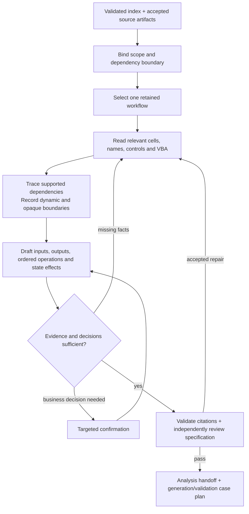

# Step 3: Evidence-based workflow analysis

Status: Step3 now uses the [result-driven agent and workflow](step3_result_driven.md). Select one value, multiple values or a finite result range and a scenario, then work backward with current query/trace tools to explain paths, offer implementation options and report known-only versus full-scope coverage. The first acceptance target is [fixed-configuration GP](../validation/pricing_gp_result_driven.md); macro batch outputs remain a later target. The macro material below is retained as background, not the current first-pilot order.

Start with `step3 agent`, declare targets and scenarios, reuse current structural artifacts, and use `query`/`trace --direction upstream` progressively. Source/reference validation and structural analysis are prerequisites and navigation; they do not replace a target path ledger or prove dynamic closure. Existing `validate --spec` checks cited facts. Dedicated target/bindings/paths/options and coverage-contract checks are planned, not implemented.

## Entry point and scope

Use `output/real_steps_20261008/step2/index.json` and its accepted source handoff. The source is `input/Pricing.xlsm`, SHA-256 `dc1de98b5e27fa85e233e7ccfa56bc21f571b2bb1686ab13b86a43a9cdfe7c7c`, run `20261008T120940-8282f510`.

Entry conditions are Step 1 `ready_for_next_step: true`, no source blockers, and Step 2 `validation_status: pass`. The source and index remain `partial` because opaque content and invalid source links are explicitly retained. These labels do not prevent bounded analysis of supported evidence.

The saved scope decision in `output/control_modules_20261006_a9a9d3/analysis_scope.json` matches the current source hash. Retain its 45 analysis sheets and exclude internal logic on:

- `CalculationOfBE_CI`
- `CalculationOfBE_MinorCI`
- `CalculationOfBE_SpecialCI`
- `CalculationOfBE_ModerateCI`

Step 1 and Step 2 continue to account for all 49 sheets. The fresh extraction confirms 49 resolved checkbox bindings on retained sheets; the four excluded sheets hold 140 resolved and all 265 invalid bindings. Keep their dependency data read-only for the saved source scenario.

When preparing Step 3 inputs, bind the scope to the new run while retaining the original decision and provenance. Recompute the dependency audit and needed source-cell snapshot from checked current artifacts. The prior audit's 864 references and 12 ranges are planning context, not fresh validation; dynamic dependencies remain unknown. A changed-scenario calculation through excluded logic requires a separate scope decision.

## Flow

| Stage | Action | Output / gate |
| --- | --- | --- |
| 1. Accept inputs | Check index references, source/run identity, saved scope and read-only dependencies | Bound scope; missing or changed inputs block analysis |
| 2. Collect evidence | Load only the chosen workflow's checked artifacts; compile existing views once if citation validation is needed | Complete source records, original locations, artifact hashes and explicit unknowns |
| 3. Describe behavior | Resolve supported names/ranges; follow static references and preserve VBA operation order | Inputs, outputs, dependencies, loop rules, calculation calls and state changes |
| 4. Confirm meaning | Apply existing classification rules as draft tags; use confirmation templates for material in-scope decisions | Confirmed or explicitly pending interpretations; facts and interpretations stay separate |
| 5. Review and hand off | Validate fact claims and review realistic workflow/data-contract behavior | Reviewed specification, blockers, next actions and later reconciliation cases |

Reuse accepted extraction artifacts throughout. Avoid reopening the workbook for every question or generating questions for every cell. Each unresolved item must identify the missing evidence or decision and the affected workflow.

## Subsequent target background: PremiumTable.CmdPremium_Click

The current accepted `activex_events.json` associates `PremiumTable.CmdPremium` with sheet code name `Sheet9` and procedure `CmdPremium_Click`. `vba_handoff.json` declares `vba_sources/010-Sheet9.cls` with SHA-256 `9d223fa6a824e11548a7f2322ed31c3d46282323a071e318147b8228a1aee9b4`.

| Evidence to read | Current source locator | Analysis purpose |
| --- | --- | --- |
| ActiveX declaration and VBA module | `PremiumTable`, `xl/activeX/activeX2.xml`, `Sheet9.CmdPremium_Click` | Establish the declared entry point and full procedure |
| `ValueTable` | `PremiumTable!A2:G8` | Scenario rows, age bounds and five supplied values |
| `Variables` | `PremiumTable!C2:G2` | Resolve variable-driven destinations in `Main` |
| `IssueAge` | `Main!C3` | Age input written for each iteration |
| `GP`, `NLP` | `Premium!J1`, `Premium!J2` | Start the output/dependency analysis |
| Other nine Premium outputs | Names read into `arr(j, 7)` through `arr(j, 15)`, plus the source procedure's complete output mapping | Specify all 15 result columns, including four Main input columns |
| Retained checkbox example | `CalculationOfBE_OtherDisease!F14`, control `Check Box 1` | Verify one retained control-to-cell evidence path |

The static procedure sequence to specify is: clear `I3:W30000`; record start time; read scenario/variable tables; switch calculation to manual; write five Main destinations; loop through each scenario's inclusive issue-age interval; call `Application.Calculate`; read 15 result fields; write rows to `PremiumTable!I:W`; restore automatic calculation; record end time and headers.

The saved `Variables` values are `Sex`, `BenefitTerm`, `PremPayPeriod`, `Sex`, `Sex`. Preserve all five writes in their source order, including repeated destinations. Current table values establish the saved configuration; other variable-driven destinations require evidence. The manifest does not supply a saved calculation mode, so initial runtime mode remains unknown.

Trace `GP` and `NLP` first, then the remaining output names. Resolve supported absolute names and ranges explicitly, including range membership. Stop at retained read-only dependency data, opaque structures or dynamic references; record why the path is incomplete. Static source inspection does not establish observed macro execution or changed-scenario results.

## Deliverables

Keep the first analysis under `output/step3_analysis/pricing/`:

| File | Content |
| --- | --- |
| `analysis_scope.json` | Current source/run identity, saved decision provenance, retained/excluded sheets and dependency policy |
| `dependency_audit.json`, `dependency_snapshot.json` | Required read-only source ranges, stored cells/caches, provenance and unresolved boundaries |
| `evidence.json` | Selected complete records and checked artifact references; views/record IDs where available |
| `workflow_spec.json`, `workflow_spec.md` | Entry point, input/output mappings, ordered operations, dependencies, state effects and uncertainty |
| `confirmation_template.json` | Material in-scope questions and recorded decisions, reusing the existing confirmation contract |
| `review.md` | Requirement-linked review findings and their resolution |
| `handoff.json`, `handoff.md` | Analysis status, validation scope, artifact checksums, blockers and next actions |

Use existing source-location and confirmation models. A new Step 3 schema should cover only the workflow specification and handoff fields actually needed by this pilot. Label claims as source facts, derivations, unverified statements or opaque reports; keep `runtime_verified: false` until runtime evidence exists.

## Implementation order and acceptance

1. Produce the single workflow specification using the current index, exported modules and reading helpers. Keep native source checks and artifacts intact. This pilot can start before additional reader commands exist.
2. If repeated exploration needs it, implement the bounded `prepare → query → trace` flow in the [progressive reading design](../design/progressive_excel_exploration.md), reusing the current CLI, views, schemas and graph builder. Those commands are proposals, not current capabilities. Canonical control packets and supported name/range expansion need their own checks.
3. Expand to other retained workflows after the pilot passes citation validation and independent review. Plan later runtime cases around a stored baseline, an input variation and the macro operation in an Excel copy; record calculation settings and observed writes.

Acceptance checks:

- Wrong source/run, missing artifacts, changed checksums or out-of-scope cells block or explicitly limit analysis.
- Every factual statement matches delivered source evidence; changed values, locations or unknown record IDs fail the existing view validator where that contract applies.
- The pilot covers every Main write, both scenario/age loops, the calculation call, all 15 result columns and final state changes.
- Excluded internal logic and its invalid controls stay outside the repair queue; retained dependency values are labeled as saved-scenario data.
- Missing semantic evidence becomes a specific confirmation or blocker. Supported fact preservation cannot be used as proof of runtime equivalence.
- A fresh reviewer checks the pilot against these requirements. Confirmed in-scope findings are repaired and reviewed again; required checks remain separate gates.

Assessment for the business-workflow pilot: existing artifacts cover indexing, controls, VBA, views and confirmation. The structural CLI implementation has its own complex-tier assessment in the linked workflow design; this document does not select a worker for the later macro specification.
