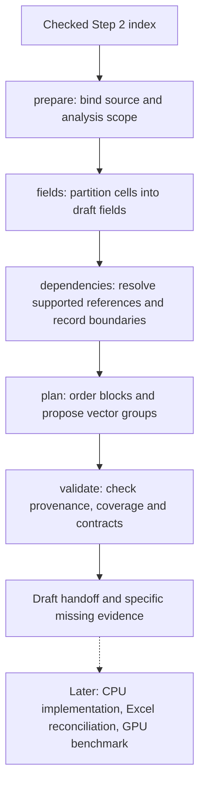

# Step 3 CLI draft: fields and execution structure

Status: implemented CLI draft, walked through on Pricing and a different two-sheet workbook. See the [run report](../validation/pricing_step3.md). The reusable static workflow reads a checked Step 2 index and produces a reviewable draft, not a formula evaluator or proof of numerical equivalence.



| Substep / CLI | Reused or added tool | Input | Deliverable |
| --- | --- | --- | --- |
| `step3 tools` | Added tool catalogue | Installed package | Commands, prerequisites, limits |
| `step3 prepare --index INDEX --step1-root ROOT --out DIR [--source-id ID] [--scope SCOPE]` | Existing Step 2 validator and artifact schemas; added source binding | Checked index; optional source-bound scope | `analysis.json`: source/run, checked input references, scope and stage state |
| `step3 fields --analysis DIR` | Existing cells, ranges and names; formula tokenizer/translation; added conservative grouping | Prepared inventory | `fields.json`, concise field report: original membership, source/calculated role, physical shape, axis candidates, formula families, names, boundaries and operation tags |
| `step3 dependencies --analysis DIR` | Existing static formula graph builder; added range-to-field mapping | Fields and checked inventory | `dependencies.json`: field edges, reference evidence, relative row/column offsets, excluded-sheet boundaries and unresolved references |
| `step3 plan --analysis DIR` | Standard-library graph ordering; added draft execution planner | Fields and dependency graph | `execution_plan.json`, readable report: dependency-first blocks, cycles/recurrence candidates, compatible vector groups and missing evidence |
| `step3 validate --analysis DIR` | Existing input validation plus added stage/provenance checks | All stage artifacts | Validation result and `handoff.json` / `handoff.md`, with structural and runtime readiness stated separately |
| `step3 input-catalog --analysis DIR --workflow DIR --targets TARGETS.json --catalog CATALOG.input.json` | Workflow-bound input checkpoint | Source/scenario-bound target selection and Agent-authored input catalog | `input_boundary.json` / `input_boundary.md`; confirms proposed inputs separately from the final design |

The `step3.input_targets.v1` target records require `target_id`, `selector`, `result_order`, `shape`, and `start_cells`. They may also carry `result_kind`, `units`, and `axes`; these optional declarations are retained in the normalized target selection and must be copied exactly into the catalog's `target_selection` for binding. Omit unknown metadata or preserve an explicit JSON `null`; both display as **Not recorded**. Human target lists follow `result_order`, while machine evidence keeps the submitted target array order.

```json
{
  "target_id": "annual_result",
  "selector": "Output!B2:B4",
  "result_order": 0,
  "shape": [3],
  "start_cells": ["Output!B2"],
  "result_kind": "vector",
  "units": "yearly amount",
  "axes": [{"name": "policy year", "axis_id": "policy_year", "role": "time", "keys": [1, 2, 3]}]
}
```

Declare axes only from the request or source-bound evidence. Cell geometry is physical layout, not a confirmed business axis.

## Contracts and limits

- Read accepted Step 1 artifacts. Never mutate the original workbook, finalized handoff, Step 2 index or scope decision. A batch index with multiple eligible sources requires an explicit source selector.
- Recheck Step 2 integrity on preparation. Bind inventory, source hash and current run; reject a scope for another workbook. Translate the existing Pricing `ignored_sheets` decision into this run's scope without trusting old dependency snapshots.
- Every retained stored cell belongs to exactly one primary field. Formula caches stay derived values. Labels/text literals are source values with unconfirmed business role, not automatically numeric inputs. Group contiguous copied formulas conservatively; keep boundary literals and unlike formulas visible. Physical dimensions are distinct from confirmed logical axes. Preserve named/table 2D range descriptors without pretending adjacent unlike columns are one field.
- Resolve static A1 references, supported scoped names and range membership. Record empty-cell references explicitly. Dynamic `INDIRECT`/`OFFSET`, external references, broken references and unsupported syntax remain visible unless a bounded resolution is supported by evidence. Never treat a cached string as a generally valid dynamic target.
- Recompute excluded-sheet boundaries from current artifacts. Saved dependency values apply only to the saved scenario; excluded internal logic is not converted.
- Edge direction and ordering must be explicit: prerequisite before consumer. Relative row/column offsets are source geometry until a logical time axis is confirmed. A field-level self-edge is not proof of a numerical cycle. Mark recurrence candidates and unresolved cycles; do not invent iteration tolerances or parallel independence.
- Proposed vector groups require compatible axes/shapes and no mutual dependency. Unconfirmed axes or dynamic references prevent an executable GPU-readiness claim. Keep input tables separate from calculated vectors.
- Every stage records source identity and prerequisite checksums. Detect changed/missing predecessors or inputs; reject stale downstream artifacts until rebuilt. Validation checks checksums, field coverage, references, block membership and dependency order. Invalid inputs return a nonzero CLI exit with a concise machine-readable explanation.
- Outputs are deterministic drafts. Re-running the same inputs gives the same analysis artifacts. Partial analysis is useful but cannot be labeled runtime verified or generation ready when semantic boundaries remain.

## First walkthrough and acceptance

Run all five stages on the existing Pricing index, carrying forward the four-sheet exclusion. Inspect `Main` input scalars, `Premium` copied column formulas, names `GP` / `NLP`, and source tables. Publish actual field counts, dependency/block counts and unresolved categories after running the tools. Also run the workflow on a small different workbook to establish that commands and identity handling are reusable.

Tests cover source/index tampering, wrong-source scope, ambiguous source selection, deterministic grouping and coverage, cached formulas, copied formulas and boundary cells, scoped names and ranges, excluded-sheet boundaries, unresolved dynamic references, dependency-first ordering, recurrence/cycle candidates, stale prerequisites and meaningful CLI failures.

Pre-implementation assessment: complex. The existing CLI, Step 2 integrity checks and source schemas supply the entry contract, but cell-to-field grouping, name/range dependencies and conservative execution planning interact across modules. Validation uses small independently expected fixtures plus the real workbook; no formula engine, new GPU backend or new dependency is needed. Select one `senior_worker` (`gpt-6-sol`, high) for implementation and repairs, followed by a fresh `gpt-6-sol`, high reviewer. Copilot is user-disabled.
