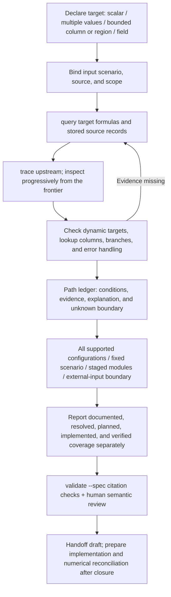

# Step 3: Result-Driven Agent and Tool Plan

**Goal:** Declare one or more values, a finite column/region, or field outputs and their scenario scope; then work backward through the required calculations. Record discovered paths, branches, shared calculations, errors, and unknown boundaries. Present implementation options with coverage denominators. Use Pricing GP as the first target decomposition. Retain all original source facts; do not recalculate or modify the source workbook.

**Implementation assessment for this increment: simple.** Add packaged `steps/step3/agent.md`, a `step3 agent` command following the Step 2 resource-reading pattern, a tools-catalog entry, package data, and one resource/CLI regression. Do not modify parsers or numerical execution. Keep the previously selected Sol/high worker for implementation and fixes; the controller prepares the real GP artifacts, followed by a fresh independent Sol/high review. Copilot is disabled by the user. Do not commit or publish.

## Minimum deliverables

- `src/excel_to_act/steps/step3/agent.md`: result targets, backward exploration, path/branch explanations, error handling, implementation options, coverage, and stopping criteria.
- `step3 agent`: prints the packaged contract; `step3 tools` lists the resource-reading capability.
- GP `target_plan.json/md`: source/scenario bindings, eight known business path units, shared modules, per-path evidence/gaps, implementation options, coverage denominators, and validation cases.
- Query/trace packet pairs and command records from the real run. Continue to use the existing seven-section `model_spec` input and validation outputs as optional citation checks.
- Documentation of current tools and proposed target/path/options validation tools, clearly marking the latter as not implemented. Do not report planning coverage as implementation or verification coverage.

## GP measurement basis

The eight known business path units are AnnuityDue, PVLoading, death, CI, WOP, survival, medical cost, and the GP feedback condition/solution path. List shared input and annual-age axes, lookups, state recurrence, timing weights, and final aggregation as separate modules; do not count them repeatedly in the path denominator. This is a finite business decomposition. It does not enumerate every cell path after loop expansion or measure development effort.

Existing unknown boundaries, dynamic bindings, static whole-table references, and feedback conditions mean that not all semantic paths are closed. Full-model/all-configuration coverage is therefore unknown. Ratios may be reported for the eight registered paths, alongside zero implementation and runtime verification and the scope still needing confirmation. Any path treated as unused must include its scenario condition and evidence. Errors must not be replaced with zero or deleted.

## From result to paths and options

A target can be one value such as `GP`, multiple values such as `GP`/`NLP`, a column such as `Premium!CA10:CA115`, or a bounded rectangle/field ID. Declare the meaning, order, and scenario for each target, then merge shared dependencies. Whole-column `A:A` is outside current bounded-query support; first define its actual extent. Do not substitute a smaller slice and still claim complete target coverage.

Skip an error outside the target only when dependency/binding evidence establishes that it is irrelevant. State the condition for a branch that is unused in the current scenario. Preserve source `IFERROR` behavior. Record errors that affect the target or whose relevance is unknown. This example has no confirmed error-path removal. Reassess excluded branches if the input or configuration domain expands.

## Tools and artifact plan

| Capability | Available tools | Purpose and output |
| --- | --- | --- |
| Read the agent contract | `step3 agent` / `step3 tools` | Host-agent workflow and tool boundaries; the CLI itself does not call AI |
| Structural navigation | `prepare`, `fields`, `dependencies`, `plan` | Source/scope binding and structural JSON; reusable existing stages, not numerical recalculation |
| Target and path evidence | `query`, `trace --direction upstream` | Paired fact pages, static dependencies, frontiers, and unknowns; progressively gather evidence for each target |
| Target, path, and option descriptions | Host agent; manually structured for now | `target_plan.json/md`: targets/scenarios, path ledger, shared modules, error categories, options, and denominators |
| Citation validation | `validate --spec` | Existing seven-section `model_spec.json/md`; a pass proves only fact/source and packet consistency |

The following are **proposed interfaces, not implemented and not part of the executed command list**:

| Proposed capability | Minimum input | Output / checks |
| --- | --- | --- |
| `step3 target` | One/multiple selectors, finite shape, result order, scenario/input domain | `target.json/md`; identity, scope, scenario, and target denominator; do not guess business axes |
| `step3 bindings` | Target formulas, current source values/names/headers, explicit scenario | `bindings.json/md`; bounded `OFFSET`, dynamic names, actual lookup columns/branches, and evidence; unsupported expressions remain unknown; no general Excel engine |
| `step3 paths` | Target, bindings, existing dependencies, evidence packets | `paths.json/md`; merge shared nodes, record paths/conditions/errors/frontiers and target mapping; cycles are recurrence/feedback units, not infinitely expanded paths |
| `step3 options` | Human-defined implementation options, path IDs, shared module IDs, configuration domain | `options.json/md`; compute planning ratios and cumulative stages over unique sets; do not choose scope for the user |
| Extend `validate` for the target ledger | Targets/paths/options and evidence | Check references, states, coverage numerators/denominators, omitted frontiers, and external-input responsibilities; a 100% known set does not automatically prove full-model closure |

Implement in order: target data contract, then bindings, then paths/options and ledger checks. Tools record facts, mechanical paths, and ratios. Agents propose and review business path names/branch interpretations. Continue using current Step 3 source/stage hashes, query/trace, and seven-section spec; do not duplicate source extraction or add a numerical engine.

## GP example artifacts and conclusion

See the [GP result-driven report](../validation/pricing_gp_result_driven.md). Local artifacts are under `output/step3_gp_result_20261008/`:

- `target_plan.json/md`: eight registered paths, four shared modules, four options, and declared denominators.
- `evidence/` and `execution_ledger.json`: ten new query groups and four trace groups; also references twenty-one existing GP-related queries.
- `model_spec.input.json` and `analysis/model_spec.json/md`: source-bound spec checked by existing tools, retaining `fact`/`inferred`/`pending` distinctions.
- `analysis/` reuses the four existing structural JSON artifacts. It does not overwrite the existing Pricing structure/specification; the original Excel and Step 1/2 artifacts remain unchanged.

Documented-ledger coverage is 8/8 = 100% **known-only**. Fully resolved, implemented, and runtime-verified coverage is 0/8. Coverage of all semantic paths and supported configurations is unknown. The staged-module plans are 3/8 = 37.5% → 5/8 = 62.5% → 7/8 = 87.5% → 8/8 = 100% (all known-only and planned; the first three stages deliver intermediate results only). For the external-intermediate option, internal upstream calculation coverage is 0/8, with caller responsibility stated separately.

A new gap found during real exploration: the static AnnuityDue trace has no frontier, but its source formula uses `OFFSET`. We queried the candidate `T9:T18` region for the current payment period of 10; its state/rate-table dependencies and actual binding still need to be traced and proven. This shows why bindings are a necessary addition to path planning. Completion of static graph traversal does not mean runtime dependency closure.

## Acceptance criteria

1. The agent contract is readable from the CLI and a built package; targets include scalars, multiple values, bounded columns/regions, and explicit result order/axes.
2. The agent must select results and scenarios first, then use current query/trace tools to work backward; frontiers, dynamic references, and excluded-range boundaries must remain recorded.
3. Each registered path includes conditions, evidence, required dependencies/shared modules, error handling, implementation boundary, and status. Unknown path counts must not be presented as a known denominator.
4. Options cover all supported configurations, a complete fixed-scenario target set, staged modules, and an explicit external-input boundary. Partial calculations must not be called complete GP.
5. Coverage states numerator, denominator, unit, scope, and stage for planned/actual/verified work; cumulative stages do not double-count shared modules.
6. Real GP files and tool listings match the commands actually run; facts/inferences/pending items remain distinct; runtime/generation/GPU readiness remain false.
7. Existing Step 3 behavior does not regress. Excel, Step 1/2, and existing structural/semantic artifacts remain unchanged. Obtain a fresh independent review PASS.
