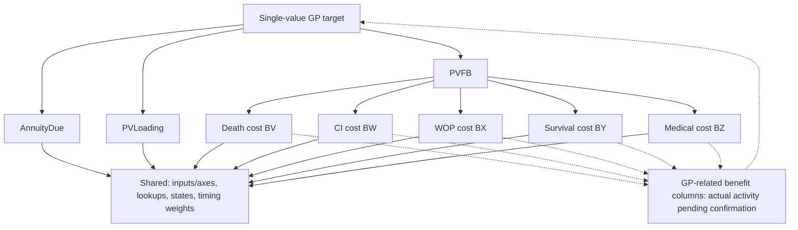

# GP: A Result-Driven Step 3 Example

This report records the earlier planning checkpoint. The later [saved-scenario GP calculation](pricing_gp_calculation.md) selects the fixed-scenario option, resolves its active bindings, and records independent Python/native Excel reconciliation. The source-bound planning artifacts below remain unchanged.

The target is the single saved-configuration value `GP` at `Premium!J1`, with source formula `PVFB/(AnnuityDue-PVLoading)`. The target contract, paths, options, and coverage are analysis drafts; no implementation option was selected and no numeric code was run.

See [Step 3 agent.md](../../src/excel_to_act/steps/step3/agent.md) for the source contract, available via `excel-to-act step3 agent`. See the [result-driven plan](../plans/step3_result_driven.md) for the method and future tool design.

## Work completed in this example

Source `695cf70322dddcb11534`, run `20261008T120940-8282f510`, SHA-256 `dc1de98b5e27fa85e233e7ccfa56bc21f571b2bb1686ab13b86a43a9cdfe7c7c`. The existing four-sheet exclusion decision was reused; existing structure was used only for navigation, and the target was not expanded to the whole workbook.

Saved inputs are IssueAge=0, Sex=Male, BenefitTerm=30, PremPayPeriod=10, SumAssured=1000, PricingIntRate=0.035, and CIDecrement=Yes. Other configuration is bound to the saved workbook and read along the paths; no inputs were overridden and the saved GP cache was not treated as the answer.

The existing `analysis.json`, `fields.json`, `dependencies.json`, and `execution_plan.json` were reused into a separate target directory; the whole workbook was not re-extracted and its fields/dependencies were not rebuilt. The new run produced 10 query groups and 4 upstream trace groups, and also referenced 21 existing GP-related queries, for 35 packets and 2,363 unique evidence IDs.



Dashed edges indicate conditions/feedback candidates that need investigation; they do not prove that all five cost categories currently depend on GP. Conditions, field IDs, shared dependencies, error handling, and evidence gaps are recorded for each path. No path was removed based on multiplication by zero, a `None` configuration, or a static whole-table reference.

## Paths and implementation options

The eight business path units are: annuity factor, present value of expenses, five cost categories, and the GP feedback condition/solver. Four shared modules are inputs and axes, lookup bindings, state recurrence, and timing weights. The root cost aggregation and GP composition are tracked separately and are not counted again in the path denominator.

| Option | Delivery scope | Planned known-path coverage | Current implementation/validation |
| --- | --- | --- | --- |
| GP for all supported configurations | Define the supported configuration domain first, then cover its relevant branches | 8/8=100% known-only; denominator across all configurations is unknown | 0/8 / 0/8 |
| GP for the current fixed configuration | Complete target for the declared scenario; do not generalize to other configurations | 8/8=100% known-only | 0/8 / 0/8 |
| Staged modules | Annuity/expenses/death → add CI/WOP → add survival/medical → assess feedback and complete GP | Cumulative 3/8, 5/8, 7/8, 8/8, or 37.5%, 62.5%, 87.5%, 100%; each is known-only and planned | 0/8 / 0/8 |
| Caller-supplied external intermediates | Caller provides PVFB/AnnuityDue/PVLoading; execute only the composition formula | 0/8 internal upstream paths; caller explicitly owns all upstream and feedback consistency | 0/8 / 0/8 |

The recommended first acceptance target is complete GP for the fixed current configuration, followed by staged module implementation. The first three stages deliver only intermediate values; required shared state includes dependencies such as CI incidence even when that stage does not yet deliver CI cost. The external-intermediate option is not a standalone GP model. All options are unselected plans; no numeric implementation is complete.

**Documentation ledger coverage is 8/8=100% known-only; fully resolved, implemented, and runtime-validated coverage is 0/8.** The documentation ledger includes explicitly recorded unknowns. The eight units do not represent all branch combinations or cell paths, so total semantic coverage remains unknown.

## Findings and next tools

The AnnuityDue static trace has only three fields and no frontier, but the source formula is `SUM(T9:OFFSET(T9,PremPayPeriod-1,0))`. At the current premium period of 10, the candidate range is T9:T18; a query for those cells has been added. The tool establishes source facts in the candidate range only; its state and incidence dependencies still need to be traced backward. **A completed static trace does not replace dynamic-range binding.**

The current PVLoading candidate range is CD10:CD19, and CD10=CC10×T9; benefit, incidence, and expense lookups differ. To determine whether GP feedback is active, confirm the actual selected columns and branches for each cost. Preserve the source form of special state/CI formulas until their business meaning and numeric reconciliation are known.

Proposed future capabilities are recorded: `target` stores the result contract; `bindings` resolves finite dynamic targets/ranges supported by evidence; `paths` maintains the path ledger; `options` computes unique-set coverage; and extended validation checks ledger consistency. **These tools are not implemented yet.** Current exploration uses query/trace and the host agent for interpretation; existing validation checks evidence references only.

Error handling categories are target-external, currently unused, handled by the source formula, blocking, or unknown. This run did not confirm any error path that can be removed; reassess if the configuration scope expands. Every known path lists its gaps, and remaining frontier stays in the ledger.

## Artifacts and reproduction

- Machine plan: [target_plan.json](../../output/step3_gp_result_20261008/target_plan.json); human-readable paths and options: [target_plan.md](../../output/step3_gp_result_20261008/target_plan.md).
- Referenced specification input: [model_spec.input.json](../../output/step3_gp_result_20261008/model_spec.input.json); validated JSON/Markdown are in `output/step3_gp_result_20261008/analysis/`.
- New evidence and commands: [execution_ledger.json](../../output/step3_gp_result_20261008/execution_ledger.json), [evidence/](../../output/step3_gp_result_20261008/evidence/). Relative paths and hashes for 21 existing packets are declared in the specification and plan.

```powershell
excel-to-act step3 agent
$analysis = "output/step3_gp_result_20261008/analysis"
excel-to-act step3 query --analysis $analysis --target GP --limit 500 --out "output/step3_gp_result_20261008/evidence/gp"
excel-to-act step3 trace --analysis $analysis --target GP --direction upstream --max-depth 1 --max-fields 20 --out "output/step3_gp_result_20261008/evidence/gp_direct"
excel-to-act step3 query --analysis $analysis --target "Premium!T9:T18" --limit 500 --out "output/step3_gp_result_20261008/evidence/annuity_current_range"
excel-to-act step3 validate --analysis $analysis --spec "output/step3_gp_result_20261008/model_spec.input.json"
```

Numeric acceptance will later require a fixed-input, newly recalculated GP and the three root intermediates; five categories of annual costs; dynamic ranges/branches; actual feedback solving; and error propagation. No Excel recalculation, macro execution, Python numeric executor, or GPU test was performed. Target closure and runtime/generation/GPU readiness all remain false.

## Acceptance in this run

The full suite passed: 243 passed with 19 existing dependency deprecation warnings; 43 focused Step 3/graph tests passed. After adding the final multi-target ordering contract, the resource/CLI focused check passed. Ruff, `git diff --check`, and wheel build passed; the packaged `agent.md` bytes matched the source file.

`validate --spec` passed with 35 packets and 2,363 verified evidence IDs. JSON/Markdown consistency was checked for 14 added packets; path coverage self-checks, repeated target-plan generation, and documentation query replays were byte-identical. Hashes of the 67 original source files and 11 existing analysis artifacts remained unchanged; see [verification.json](../../output/step3_gp_result_20261008/verification.json). The new independent review is **PASS**; see [review_2.md](../../output/step3_gp_result_20261008/review_2.md). These passes do not prove GP semantic closure or numeric equivalence.
