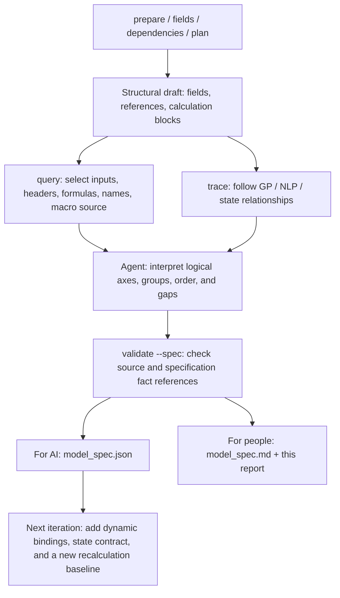

# Pricing: Further Step 3 Exploration and Conversion Specification

Step 3 aims to produce a traceable conversion specification: what the inputs are, which axes organize the fields, what the calculation order is, which outputs are targeted, and what information is still missing. This first draft now uses facts from the real Pricing source and is sufficient to plan Python modules and reconciliation points; full generation, numeric equivalence, and GPU performance still require later validation.

This run used the existing Step 1/Step 2 source `695cf70322dddcb11534`, run `20261008T120940-8282f510`, and workbook SHA-256 `dc1de98b5e27fa85e233e7ccfa56bc21f571b2bb1686ab13b86a43a9cdfe7c7c`. The previously bound four-sheet exclusion scope was reused; Excel was not re-extracted or modified.

## What each tool does toward the goal



| Tool | Analysis performed | Deliverable |
| --- | --- | --- |
| `step3 query` | Main inputs/configuration, Premium initialization, axes, matrices, costs, discounting, lookup keys; ValueTable, Variables, and static source for Sheet9 | 28 `query.json/md` packets with source locations and complete evidence objects |
| `step3 trace` | GP/NLP upstream, incidence downstream, death-cost upstream, state upstream, and accumulated-premium downstream | 6 `trace.json/md` packets with fields, edges, unknowns, and frontier |
| Agent reading and drafting | Field roles, logical axes, group order, outputs, macro workflow, open questions, validation plan | `model_spec.input.json`; 10 fact records, 16 inferences, 17 pending items |
| `step3 validate --spec` | Checks source, stage hashes, declared packet hashes, and specification facts; retains inferred/pending status | `model_spec.json/md`, with references and file hashes registered in the handoff |

Artifact paths are relative to the repository root:

- AI specification: [model_spec.json](../../output/step3_pricing_20261008/analysis/model_spec.json); human-readable specification: [model_spec.md](../../output/step3_pricing_20261008/analysis/model_spec.md). Both are generated from the same specification.
- Raw evidence: [evidence/](../../output/step3_exploration_20261008/evidence/), 34 packets with 4,835 unique evidence IDs after merging.
- Exploration summary: [exploration_summary.json](../../output/step3_exploration_20261008/exploration_summary.json); specification input: [model_spec.input.json](../../output/step3_exploration_20261008/model_spec.input.json).
- Re-runnable selection list for this example: [run_evidence.py](../../output/step3_exploration_20261008/run_evidence.py). The script calls only the generic CLI and adds no product rules; targets must be selected again for another workbook.

`output/` remains a local artifact directory ignored by Git. Conclusions below apply to this source and its currently saved configuration; cached values were not treated as new recalculation results. Fact records preserve canonical source values; business interpretations and logical shapes are marked `inferred`, and gaps are marked `pending`.

## Calculation structure evidenced by the real workbook

| Structure | Current evidence and interpretation | Candidate Python organization |
| --- | --- | --- |
| Input scalars | Main C3/C4/C6/C7/C8: IssueAge, Sex, BenefitTerm, PremPayPeriod, SumAssured | Single-scenario input object; units and valid ranges pending confirmation |
| Year and age | Premium B10:B115 contains years 1..106, and C10=`IssueAge+B10-1`; some row 9 cells are year-0 initial values | Explicit year axis and initial index for each state; do not shift by row number alone |
| Death incidence | Y10:AH115, ten columns; AA7 prefix and AA10 dynamic-name formula | Candidate 106×10 matrix; preserve the original order of the ten columns first |
| Death benefit | AV10:BE115, ten columns; benefit lookup is multiplied by coverage-period indicator E | Candidate benefit matrix on the same year × category axes |
| State recurrence | J11=`Q10`; G/H/I and other columns use prior-row states; P/Q split due and subsequent states | Forward annual loop within a scenario; preserve source-reference order within each group |
| Timing weights | T/U/V use exponents t, t−0.5, t−1, while numerators include Q+P or J | Three discounted vectors that depend on state |
| Costs | BV death, BW CI, BX WOP, BY survival, BZ medical; CA aggregates them | Compute five vectors from their respective states and timings, then reduce by year |
| Premium | PVFB/AnnuityDue/PVLoading are aggregated before producing NLP/GP | Scalar reduction; if actual benefits depend on GP, first add a feedback-solver contract |

These groups are not based only on equal lengths. `BV10=SUMPRODUCT(Y10:AH10,AV10:BE10)*U10` is direct formula evidence for a row-wise dot product of same-axis matrices. State columns depend on prior rows and therefore suit a shared annual loop; years must not be treated as independent parallel tasks.

### Dynamic bindings have some evidence; general rules are still missing

AA7 is currently `SelfDriveAccDeathInc`. Four exact-name queries confirm Fix=0, Mult=1, and TabM/TabF=`SelfDrive`, sourced from Main J17:M17 respectively. These facts support a binding for this scenario; a changed configuration still requires confirmation of the full prefix set, gender branches, target columns, and not-found behavior.

The incidence lookup in AA10 explicitly uses `VLOOKUP` with `FALSE`. The benefit lookup in AV10 omits the fourth argument, while the CC10 cost lookup uses `TRUE`; they must not all be replaced with exact dictionary lookups. This run also queried the Benefit_Table year keys: current nonblank keys 1..106 are strictly increasing. Blank trailing rows, out-of-range keys, duplicate keys, and error behavior still need reconciliation.

Evidence: [incidence](../../output/step3_exploration_20261008/evidence/incidence_matrix/query.md), [benefit](../../output/step3_exploration_20261008/evidence/benefit_matrix/query.md), [current dynamic names](../../output/step3_exploration_20261008/evidence/dynamic_male/query.md), [benefit keys](../../output/step3_exploration_20261008/evidence/benefit_key_values/query.md).

### Continue exploring selected columns for the GP candidate cycle

GP=`PVFB/(AnnuityDue-PVLoading)`; Benefit_Table J5=`IF(C5<PremPayPeriod,GP*C5,GP*PremPayPeriod)`. The static graph treats the whole lookup region as a dependency, so the accumulated-premium column may appear upstream of GP.

The current death-benefit choice is `Level100`/`None`, corresponding to columns E/F. This shows that a whole-table static reference can enlarge a candidate cycle; it does not prove that all costs or other configurations lack real feedback. The next iteration should first narrow dependencies using actual dynamic names, selected columns, and branches, then determine whether iteration is needed and identify its initial value and stopping rule. The specification does not presume a solver.

Cost timing also cannot be made uniform: with the current premium period of 10, AnnuityDue references T9:T18, while PVLoading references CD10:CD19; CD10 also uses T9. These starting points directly affect the premium denominator.

Evidence: [bounded GP upstream](../../output/step3_exploration_20261008/evidence/gp_upstream/trace.md), [accumulated-premium column](../../output/step3_exploration_20261008/evidence/gp_table_link/query.md), [premium and present-value formulas](../../output/step3_exploration_20261008/evidence/scalar_outputs/query.md).

### Retain the original forms of two state formulas until their business meaning is known

The source expression for I11 is `IFERROR(MAX(H10+(-K10-L10+O10-P10)/J10*I10-N10,0),0)`, and its initial term uses H10; the CI term in BW10 includes `I10*$I10`. These expressions must not be rewritten based on column names alone. The specification retains the original formulas and lists their business intent and year-by-year results as P0 evidence gaps.

Evidence: [state initialization and recurrence](../../output/step3_exploration_20261008/evidence/axis_initial/query.md), [cost formula](../../output/step3_exploration_20261008/evidence/cost_loading/query.md).

### The macro defines a scenario batch and output contract

Sheet9's `CmdPremium_Click` statically reads six scenarios from ValueTable: Male/Female × premium periods 10/20/30, each with issue ages 25..40 and benefit term 30. The source loops imply 96×15 outputs; the macro was not run to verify this result.

The five Variables targets, in order, are `Sex, BenefitTerm, PremPayPeriod, Sex, Sex`. The source writes them in that order, so all three Sex writes must be preserved; their values agree across the current six rows, but with conflicting values the last write wins. For each age, the macro writes IssueAge, runs `Application.Calculate`, collects GP/NLP, totals for four cost categories, and five ratios, then writes to I:W. The complete 15-column mapping is preserved in the specification.

The macro also clears I3:W30000, changes calculation mode, and records time. Querying module source does not prove which worksheet or control is bound to it; the event association and post-run state restoration require more evidence.

Evidence: [full macro source](../../output/step3_exploration_20261008/evidence/macro_source/query.md), [six scenarios](../../output/step3_exploration_20261008/evidence/scenario_table/query.md), [variable order](../../output/step3_exploration_20261008/evidence/scenario_variables/query.md).

## What the next Step 3 iteration still needs to explore

| Priority | Question to resolve | Existing tools and evidence to add | Planned artifact, not yet generated |
| --- | --- | --- | --- |
| P0 | Dynamic names/lookup columns and whether GP has real feedback | Use `query` for full configuration/names/target columns, `trace` to follow the frontier; add actual branches and iteration settings | `active_dependency_plan.json`, `lookup_contract.json` |
| P0 | State meaning, timing, and the two special formulas | Use `query` to preserve initialization/recurrence; add actuarial definitions and a newly recalculated Excel annual trajectory | `state_contract.json` |
| P0 | Usable numeric baseline and error standard | Fix inputs in an Excel copy, recalculate, and output states/costs/premiums; first confirm business units and valid domain | `excel_baseline.json` |
| P1 | Role and axis coverage for all target fields | Group uncovered fields for query/trace; handle dynamic and excluded-sheet boundaries | `semantic_coverage.json`, `target_closure.json` |
| P1 | Macro event, batch independence, and repeated writes | Add control-event association evidence; run six scenarios and conflicting-Sex/continuous-run cases | `macro_baseline.json` |
| P2 | Whether CPU modules and GPU grouping are effective | After CPU reconciliation, measure scenario batch size, time, memory, and error | `backend_benchmark.json` |

These questions and nine runtime-validation cases are recorded structurally in `open_questions` / `validation_plan` in `model_spec.json`. Resolve P0 items first before converting static calculation blocks into a trusted execution order. Use Python CPU as the reconciliation baseline; scenario/issue-age batches and death categories are parallel candidates, while preserving temporal order within each state group.

## Reproduction and acceptance

```powershell
$analysis = "output/step3_pricing_20261008/analysis"
excel-to-act step3 query --analysis $analysis --target "Premium!Y6:AH11" --limit 500 --out "output/step3_exploration_20261008/evidence/incidence_matrix"
excel-to-act step3 trace --analysis $analysis --target GP --direction upstream --max-depth 6 --max-fields 200 --out "output/step3_exploration_20261008/evidence/gp_upstream"
excel-to-act step3 query --analysis $analysis --target "vba:Sheet9" --out "output/step3_exploration_20261008/evidence/macro_source"
excel-to-act step3 validate --analysis $analysis --spec "output/step3_exploration_20261008/model_spec.input.json"
```

All selected queries reached their final page; the 791 stored LoadingTable records were split into pages of 500+291, with the second page at [loading_table_page2](../../output/step3_exploration_20261008/evidence/loading_table_page2/query.md). All six traces have truncation boundaries. For example, GP upstream includes 200 fields and 500 edges and stopped at the field/edge limits. These are exploration evidence, not complete closure. For further exploration, use field IDs from `frontier` to query/trace each frontier and record unresolved dynamic and range boundaries.

The generic commands also passed query, trace, and specification validation on a separate `Reusable.xlsx`; that trace covered four fields and completed. Paired query/trace and specification reruns were checked for byte identity; invalid specifications did not overwrite valid ones; ordinary validation retained specification references. The 67 Excel/Step 1/Step 2 source files and three structural-artifact hashes remained unchanged. See [verification.json](../../output/step3_exploration_20261008/verification.json) for the validation record.

The full test suite passed (242 passed, with 19 existing oletools/pyparsing deprecation warnings); 42 focused Step 3/graph tests passed; Ruff and `git diff --check` passed. Final specification validation passed with 34 packets and 4,835 canonical evidence IDs. The new independent review is **PASS**; see [review_2.md](../../output/step3_exploration_20261008/review_2.md).

All `runtime_verified`, `generation_ready`, and `gpu_executable` values remain false: this run delivered a reviewable static semantic draft. It did not include a new Excel recalculation, macro execution, Python executor, or GPU performance conclusion.
