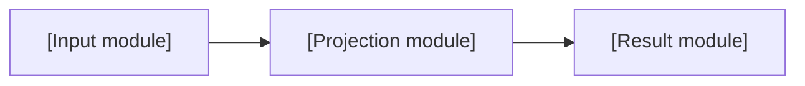

# Model Conversion Report

Report status: **Ready for review**

Replace bracketed prompts only with facts supported by the accepted workflow artifacts. Remove a prompt when the corresponding fact is unavailable; state that it is not recorded rather than guessing. The CLI renderer remains canonical, so use this as a writing and review scaffold rather than a second report format.

## Executive summary

| Classification | Measure | Converted model | Workbook | Difference | Check |
| --- | --- | --- | --- | --- | --- |
| [Requested result / diagnostic intermediate / additional check] | [Accepted name] | [Value] | [Value] | [Difference] | [Matched / not matched / not reported] |

[Scoped conclusion for the accepted scenario, using recorded tolerances and reconciliation evidence.]

## Purpose/intended use/scope

[What this handover supports and who will use it.]

**Declared boundary:** [Accepted scope and saved scenario.]

**Included in the accepted design:**

- [Included model behavior supported by the accepted design.]

**Excluded from this result:**

- [Untested scenarios, algorithms, solvers, deployment, or other exclusions stated by the accepted evidence.]

## Source model and inputs/assumptions

Source: [Workbook link]. Run [run identifier]; source ID [source identifier].

| Output | Order | Shape | Units / basis | Meaning |
| --- | --- | --- | --- | --- |
| [Accepted target name] | [Recorded order] | [Shape] | [Accepted units or basis] | [Meaning from accepted metadata] |

[Explain the accepted scalar, vector, and table totals and what each structure represents.]

| Source tab | Raw variables | Formula-derived external | Total variables |
| --- | ---: | ---: | ---: |
| [Source tab] | [Count] | [Count] | [Count] |

| Input group | Classification | Objects | Kinds, dimensions, and axes |
| --- | --- | ---: | --- |
| [Accepted group] | [Recorded classification] | [Count] | [Shape and keyed axis] |

[Link the verified input-boundary catalog and any useful source-location index.]

## Calculation design and time/module order

Accepted calculation order: [Design-time order from the accepted design.]

[Explain the time axis, alignment, recurrence seeds/prior-state use, and result equation using accepted formula notes.]

| Order | Module | Responsibility |
| ---: | --- | --- |
| [Order] | [Module] | [Accepted responsibility] |

| Field group | Shape and time alignment | Source extents |
| --- | --- | --- |
| [Accepted group] | [Vectors, matrices, keys, or timing] | [Source locations] |

## Conversion approach

Backend: [Recorded runtime/backend]. [Summarize generated variables, derived variables, equation functions, dependencies, and any source-to-code traceability facts that are recorded.]

[Describe any separately supplied formula-derived inputs and their accepted binding/capture evidence.]

## Validation and reconciliation results

**Validation method:** [Recorded standalone execution and native workbook comparison method, including only recorded engine, macro, override, version, or iteration details.]

| Measure | Observed | Required |
| --- | ---: | ---: |
| Requested result checks | [Count] | [Count or not recorded] |
| Primary source inputs | [Count] | [Count or not recorded] |
| Active formula members | [Count] | [Count or not recorded] |
| Formula identity matches | [Count] | [Count or not recorded] |
| External input coordinates/formula-cut members | [Count] | [Count or not recorded] |
| Key-axis entries | [Count] | [Count or not recorded] |

Maximum absolute difference: [Recorded value or not recorded]. Comparison tolerances: absolute [value]; relative [value]. Mismatches: [count or not recorded].

[Summarize generated and runtime-verified numerical routes from matched evidence. Describe condition-only checks separately; an inactive condition does not establish a solver.]

## Differences/limitations/open decisions

- [Recorded comparison difference or limitation.]
- [Partial extraction or unsupported source behavior, when recorded.]
- [Actual unresolved business interpretation, preserving its uncertainty.]
- [Clarify which design-time questions remain historical and which execution prerequisites have measured evidence.]

This report does not establish actuarial certification, professional-standard compliance, production deployment, all-configuration coverage, or unsupported performance.

## Handover/run instructions

- Generated bundle: [Link].
- Runnable entry point and command: [Link and recorded run command].
- Supporting design, generation, and validation reports: [Links].

## Acceptance

This report is generated ready for review. Required reviewers are determined by the current workflow status and active delegation. Later decisions are recorded in the workflow acceptance ledger: [Link]. Keep the accepted JSON/Markdown pair unchanged after decisions are recorded.

## Appendices

### A. Detailed evidence and artifact hashes

[Accepted stage-pair hashes, bundle-file hashes, and validation artifact bindings.]

### B. Review history

[Reviewer, decision, timestamp, and message for each accepted receipt.]

### C. Prior option and question history

[Preserve design-time options and question text/dispositions. Identify them as history; do not infer that later numerical agreement resolves business meaning.]

### D. Input-boundary source records

[Source locations and saved input literals, linked to the verified catalog.]

### E. Report organization references

[References used to inform report presentation. Do not imply professional-standard compliance.]
